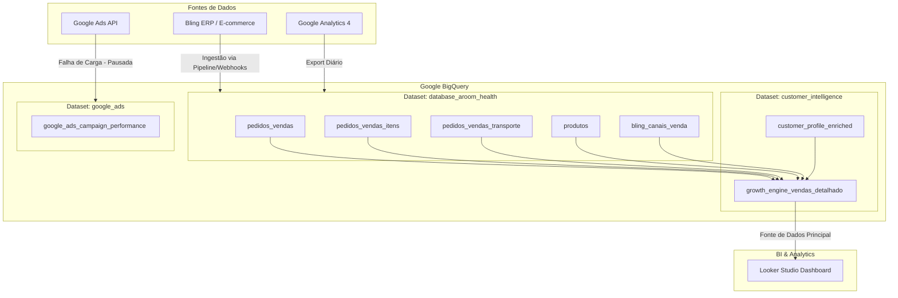

# Arquitetura de Dados & Camada BI Engine - Aroom Health

Este documento descreve a infraestrutura de dados atual, fluxo de ingestão, particionamento e dependências da camada de visualização no GCP/BigQuery.

---

## 🎨 Diagrama da Arquitetura Geral (Big Picture)

---

## 🏗️ Diagrama de Arquitetura de Dados (Data Flow)

O diagrama abaixo ilustra como os dados fluem dos sistemas de origem até os relatórios no Looker Studio.

---

## 📂 Conjuntos de Dados (Datasets) do BigQuery

### 1. `database_aroom_health`
Este dataset armazena os dados transacionais brutos replicados do ERP Bling e outras origens transacionais.
* **`pedidos_vendas`**: Cabeçalho dos pedidos, contendo data da venda, identificador, ID do cliente e ID do canal de venda.
* **`pedidos_vendas_itens`**: Detalhamento dos produtos contidos em cada pedido (granularidade de item).
* **`pedidos_vendas_transporte`**: Informações de frete associadas aos pedidos.
* **`produtos`**: Cadastro e preço de custo de cada produto.
* **`bling_canais_venda`**: De/Para de canais de venda (Shopee, Mercado Livre, Site Próprio, etc.).

### 2. `customer_intelligence`
Dataset responsável por modelos de inteligência de clientes e pela consolidação da camada de negócios.
* **`customer_profile_enriched`**: Tabela enriquecida com perfis dos clientes (ex: UF de origem).
* **`growth_engine_vendas_detalhado`**: A **view principal de produção** que limpa, agrega e enriquece os dados transacionais com as regras da SmartMetrics BI Engine.

### 3. `google_ads`
Dataset de performance de marketing digital.
* **`google_ads_campaign_performance`**: Contém impressões, cliques, custos de campanha. *Atualmente pausado/quebrado desde 12/12/2025.*

---

## 📈 Conexão com o Looker Studio

O painel de controle principal do Looker Studio aponta exclusivamente para a view `growth_engine_vendas_detalhado` no dataset `customer_intelligence`.

> [!WARNING]
> Qualquer alteração estrutural (como remoção ou renomeação de colunas) nesta view afetará diretamente os gráficos do Looker Studio, causando erros de visualização para a diretoria. Use sempre a view de staging para validação e siga o checklist de implantação.
