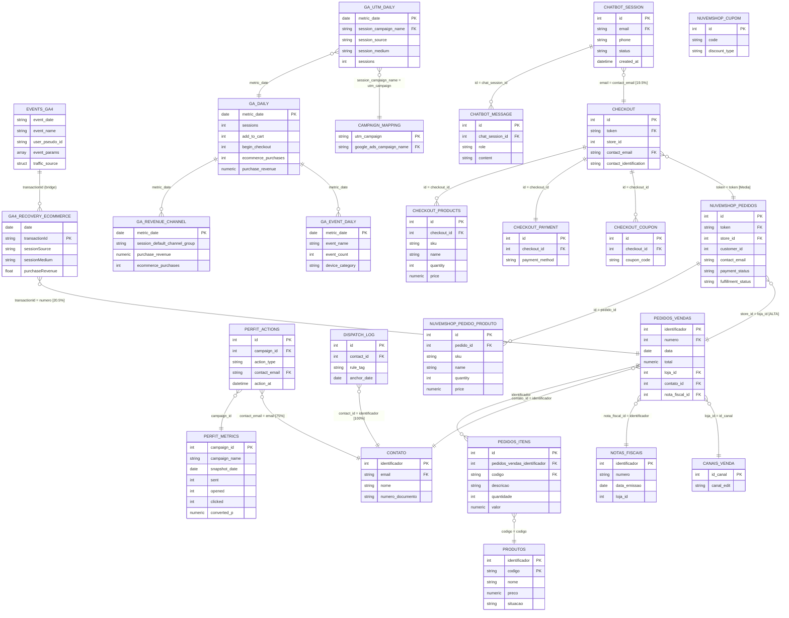

# Architecture Data Model — Frontend × Backend × Bling
**Versão:** 1.0 | **Data:** 22/06/2026 | **Projeto:** iron-rex-461220-g4

---

## 1. Arquitetura Visual — Três Camadas

```
╔══════════════════════════════════════════════════════════════════════════════════╗
║                    LAYER 1 — FRONTEND (Comportamento Digital)                  ║
╠══════════════════════════════════════╦═════════════════════════════════════════╣
║  GA4 NATIVO                          ║  GA4 PRÉ-AGREGADO (pipeline próprio)   ║
║  analytics_414017556                 ║  database_aroom_health                 ║
║  ─────────────────                   ║  ─────────────────────────────────     ║
║  events_YYYYMMDD (18 tabelas)        ║  google_analytics_daily                ║
║  ├── 185.602 eventos totais          ║  ├── 538 linhas | R$ 1.682.913         ║
║  ├── 266 purchase events             ║  ├── 16.236 transações | Jan/25–Jun/26  ║
║  ├── 3.673 add_to_cart               ║  google_analytics_utm_daily            ║
║  ├── 431 begin_checkout              ║  ├── 21.266 linhas | Jan/25–Jun/26     ║
║  ├── 17.881 sessions                 ║  google_analytics_revenue_channel_daily ║
║  └── 12.272 first_visits             ║  ├── 3.292 linhas | R$ 1.682.913       ║
║  Período: Nov/2025 → Jun/2026        ║  google_analytics_event_daily          ║
║                                      ║  └── 8.444 linhas                      ║
╠══════════════════════════════════════╬═════════════════════════════════════════╣
║  EMAIL / CRM (Perfit + Dispatch)     ║  CHATBOT                               ║
║  database_aroom_health               ║  database_aroom_health                 ║
║  ─────────────────                   ║  ─────────────                         ║
║  perfit_campaign_actions             ║  chatbot_session                       ║
║  ├── 297.434 eventos                 ║  ├── 503 sessões                       ║
║  ├── 169k SENT | 121k OPEN           ║  └── Mar/2026 → Jun/2026               ║
║  └── 6.656 emails únicos             ║  chatbot_message                       ║
║  perfit_campaign_metrics             ║  └── 1.660 mensagens                   ║
║  ├── 758 snapshots de campanha       ║                                        ║
║  dispatch_send_log                   ║                                        ║
║  └── 22.376 envios automáticos       ║                                        ║
╚══════════════════════════════════════╩═════════════════════════════════════════╝
         │                    │                    │                │
         │ transactionId      │ session_campaign    │ contact_email  │ contact_id
         │ = numero_pedido    │ = utm_campaign      │ = email        │ = identificador
         ▼                    ▼                    ▼                ▼
╔══════════════════════════════════════════════════════════════════════════════════╗
║                 LAYER 2 — BACKEND / E-COMMERCE (Site Nuvemshop)                ║
╠══════════════════════════════════════════════════════════════════════════════════╣
║  database_aroom_health                                                         ║
║  ────────────────────────────────────────────────────────────────────────────  ║
║  checkout                          nuvemshop_pedidos                           ║
║  ├── 2.568 carrinhos               ├── 19.915 pedidos concluídos               ║
║  ├── 2.294 emails únicos           ├── 16.882 clientes únicos                  ║
║  └── Nov/2025 → Jun/2026           └── Jan/2025 → Jun/2026                     ║
║                                                                                ║
║  checkout_products                 nuvemshop_pedido_produto                   ║
║  └── 7.193 itens no carrinho       └── 48.690 itens por pedido                 ║
║                                                                                ║
║  checkout_payment_details          nuvemshop_cupom                            ║
║  └── 2.568 métodos de pagamento    └── 12.734 cupons configurados              ║
║                                                                                ║
║  checkout_coupon                                                               ║
║  └── 975 cupons utilizados                                                     ║
╚══════════════════════════════════════════════════════════════════════════════════╝
                    │
                    │ store_id = loja_id (Alta confiança)
                    │ 23.841 pedidos / R$ 2.850.297
                    ▼
╔══════════════════════════════════════════════════════════════════════════════════╗
║                    LAYER 3 — BLING ERP (Fonte de Verdade)                      ║
╠══════════════════════════════════════════════════════════════════════════════════╣
║  database_aroom_health — RECEITA AUDITADA: R$ 9.538.019 / 130.135 pedidos     ║
║  ────────────────────────────────────────────────────────────────────────────  ║
║  pedidos_vendas              pedidos_vendas_itens         contato              ║
║  ├── 130.135 pedidos         ├── 187.875 itens            ├── 120.479 clientes ║
║  ├── 2021 → Jun/2026         └── R$ 9.054.613             └── Fev/2025–Jun/26  ║
║                                                                                ║
║  produtos                    notas_fiscais_saida           bling_estoque       ║
║  ├── 9.751 total             ├── 73.286 notas fiscais      ├── 44.117 saldos   ║
║  └── 1.730 ativos            └── 2021 → Jun/2026           └── 9.746 produtos  ║
║                                                                                ║
║  contas_receber              contas_pagar                  bling_canais_venda  ║
║  ├── 92.353 títulos          ├── 3.348 títulos             └── 76 canais       ║
║  └── R$ 7.145.571            └── R$ 5.574.797                                  ║
╚══════════════════════════════════════════════════════════════════════════════════╝
```

---

## 2. Diagrama ERD — Relações entre as três camadas



---

## 3. Counts por Fonte — Resumo Consolidado

### Layer 1 — Frontend

| Tabela | Dataset | Linhas | Métrica Principal | Período |
|:---|:---|---:|:---|:---|
| `events_*` (GA4 Nativo) | analytics_414017556 | 185.602 | 266 purchase / 17.881 sessions | Nov/2025–Jun/2026 |
| `google_analytics_daily` | db_aroom_health | 538 | R$ 1.682.913 / 16.236 tx | Jan/2025–Jun/2026 |
| `google_analytics_utm_daily` | db_aroom_health | 21.266 | Sessões por campanha UTM | Jan/2025–Jun/2026 |
| `google_analytics_revenue_channel_daily` | db_aroom_health | 3.292 | R$ 1.682.913 / canal | Jan/2025–Jun/2026 |
| `google_analytics_event_daily` | db_aroom_health | 8.444 | Eventos por tipo | Jan/2025–Jun/2026 |
| `ga4_recovery_traffic_sources` | analytics_recovery | 6.942 | Sessões por fonte/campanha | Dez/2025–Jun/2026 |
| `ga4_recovery_ecommerce` | analytics_recovery | 5.427 | 4.955 tx / R$ 512.023 | Dez/2025–Jun/2026 |
| `ga4_recovery_events` | analytics_recovery | 3.559 | 529.625 eventos totais | Dez/2025–Jun/2026 |
| `ga4_recovery_pages` | analytics_recovery | 36.671 | Landing pages | Dez/2025–Jun/2026 |
| `ga4_recovery_geo` | analytics_recovery | 50.884 | Usuários por cidade | Dez/2025–Jun/2026 |
| `ga4_recovery_devices` | analytics_recovery | 1.442 | Sessões por dispositivo | Dez/2025–Jun/2026 |
| `perfit_campaign_actions` | db_aroom_health | 297.434 | 169k SENT / 121k OPEN / 5,7k CLICK | Mar/2026–Jun/2026 |
| `perfit_campaign_metrics` | db_aroom_health | 758 | KPIs de campanha email | Jun/2026 |
| `dispatch_send_log` | db_aroom_health | 22.376 | 4 automações ativas | Abr/2026–Jun/2026 |
| `chatbot_session` | db_aroom_health | 503 | 503 conversas | Mar/2026–Jun/2026 |
| `chatbot_message` | db_aroom_health | 1.660 | 1.660 mensagens | Mar/2026–Jun/2026 |

### Layer 2 — Backend / E-commerce

| Tabela | Linhas | Únicos | Período |
|:---|---:|:---|:---|
| `nuvemshop_pedido_produto` | 48.690 | — | — |
| `nuvemshop_pedidos` | 19.915 | 16.882 clientes | Jan/2025–Jun/2026 |
| `nuvemshop_cupom` | 12.734 | — | — |
| `checkout_products` | 7.193 | — | Dez/2025–Jun/2026 |
| `checkout` | 2.568 | 2.294 emails | Nov/2025–Jun/2026 |
| `checkout_payment_details` | 2.568 | — | Dez/2025–Jun/2026 |
| `checkout_coupon` | 975 | — | Dez/2025–Jun/2026 |
| `checkout_interaction_log` | 300 | — | Jan/2026–Jun/2026 |

### Layer 3 — Bling ERP

| Tabela | Linhas | Métrica Principal | Período |
|:---|---:|:---|:---|
| `pedidos_vendas_itens` | 187.875 | R$ 9.054.613 em itens | 2021–2026 |
| `pedidos_vendas` | 130.135 | **R$ 9.538.019** (fonte de verdade) | 2021–2026 |
| `contato` | 120.479 | 120.479 clientes únicos | Fev/2025–Jun/2026 |
| `contas_receber` | 92.353 | R$ 7.145.571 | 2024–2027 |
| `notas_fiscais_saida` | 73.286 | 73.286 NFs emitidas | 2021–2026 |
| `bling_estoque_saldos` | 44.117 | 9.746 produtos com saldo | snapshot atual |
| `produtos` (total) | 9.751 | 9.749 SKUs únicos | — |
| `produtos` (ativos) | 1.730 | **1.728 SKUs ativos** | — |
| `contas_pagar` | 3.348 | R$ 5.574.797 | 2023–2027 |
| `bling_canais_venda` | 76 | 76 canais mapeados | — |

---

## 4. Auditoria de SKUs Faltantes no Bling ⚠️

### Sumário do Gap

| Métrica | Valor |
|:---|---:|
| SKUs vendidos **sem cadastro** em `produtos` | **510 SKUs** |
| Linhas de item afetadas | 1.704 |
| Pedidos impactados | 1.437 |
| Receita sem SKU cadastrado | **R$ 95.170,43** |
| % das linhas de item total | **0,91%** |

> **Impacto:** R$ 95.170 (≈1% da receita) vendidos sem produto cadastrado. Inviabiliza cálculo de margem, giro de estoque e categorização para esses itens.

### Top 30 SKUs Faltantes (por Receita)

| SKU | Descrição | Pedidos | Receita | Período |
|:---|:---|---:|---:|:---|
| `5503full` | Óleo Vegetal Ojon Batana 100ml | 34 | R$ 3.136 | Out/25–Mai/26 |
| `0485full` | Kit Óleos Alecrim, Ojon, Rícino 100ml | 20 | R$ 2.972 | Jul/25–Set/25 |
| `1208full` | Óleo Rosa Mosqueta 20ml | 72 | R$ 2.791 | Ago/25–Set/25 |
| `0034` | Fórmula Exclusiva Elixir Detox 50ml | 42+13+11 | R$ 3.689 | Abr/25–Ago/29 |
| `0058` | Blend Duo Alecrim 30ml | 47+26 | R$ 3.113 | Abr/25–Out/25 |
| `MLB2662837420` | Avental TNT Descartável 10un | 29 | R$ 1.892 | Jun/22–Abr/23 |
| `175445201615` | Avental TNT Colorido 15pcs | 26 | R$ 1.862 | Nov/22–Mai/23 |
| `175445201617` | Avental TNT Colorido 15pcs | 30 | R$ 1.774 | Nov/22–Abr/23 |
| `5565FULL` | Óleo Ojon/Batana Polpa 30ml | 37 | R$ 1.499 | Out/25–Mai/26 |
| `0836full` | Óleo Alecrim 100ml | 19+13 | R$ 2.462 | Jul/25–Set/25 |

### Padrões Identificados nos SKUs Faltantes

| Padrão | Exemplos | Causa Provável |
|:---|:---|:---|
| Sufixo `full` | `5503full`, `0485full`, `0836full`, `5565FULL` | Variante de volume (Full Size) sem SKU separado no catálogo |
| Prefixo `MLB` | `MLB2662837420`, `MLB3017702198`, `MLB3271584241` | SKUs de marketplace ML usados no pedido mas não cadastrados no Bling |
| Números MLB longos | `175445201615`, `175445201617` | IDs de produto ML antigos (2022–2023) sem correspondência |
| SKUs numéricos simples descontinuados | `0034`, `0058`, `1162`, `3455`, `0201` | Produtos reformulados ou renomeados — SKU antigo ainda aparece em pedidos históricos |
| Prefixo numérico + `FULL` | `1369FULL`, `1406FULL`, `7897full` | Mesmo padrão de variante sem cadastro |

### Recomendações (Phase 2)

1. **Criar 510 SKUs faltantes** ou mapear `codigo` antigo → SKU atual via tabela de-para de produtos.
2. **Padronizar sufixo `full`**: avaliar se é variante de volume e cadastrar como variante do produto pai.
3. **Depurar SKUs MLB antigos**: verificar se são produtos vendidos por terceiros (dropshipping?) ou erros de cadastro do marketplace.
4. **Monitorar**: criar alerta quando `pedidos_vendas_itens.codigo` não existir em `produtos.codigo`.

---

## 5. Pontes entre Camadas — Confidence Matrix

| Bridge | Campo Fonte | → Campo Destino | Confiança | Cobertura | Obs |
|:---|:---|:---|:---:|:---|:---|
| GA4 → Bling | `ga4_recovery_ecommerce.transactionId` | `pedidos_vendas.numero` | 🟡 MÉDIA | 20,5% | AdBlock / cookie bloqueia |
| GA4 UTM → Google Ads | `ga_utm_daily.session_campaign_name` | `campaign_name_mapping.utm_campaign` | 🟢 ALTA | 54 campanhas | De-para resolvido |
| Backend → Bling | `nuvemshop_pedidos.store_id` | `pedidos_vendas.loja_id` | 🟢 ALTA | R$ 2,85M confirmado | Canal "Site Aroom" |
| Checkout → Backend | `checkout.token` | `nuvemshop_pedidos.token` | 🟡 MÉDIA | Needs validation | Abandonados incluídos |
| Email → Bling | `perfit_actions.contact_email` | `contato.email` | 🟢 ALTA | 75% (4.994 clientes) | Case insensitive |
| Email → Bling | `dispatch_log.contact_id` | `contato.identificador` | 🟢 ALTA | 100% (FK nativa) | Join direto |
| Chatbot → Backend | `chatbot_session.email` | `checkout.contact_email` | 🔴 BAIXA | 19,5% | Volume baixo |
| Bling → Produto | `pedidos_itens.codigo` | `produtos.codigo` | 🟡 MÉDIA | ~99,1% (510 SKUs gap) | Auditado acima |
