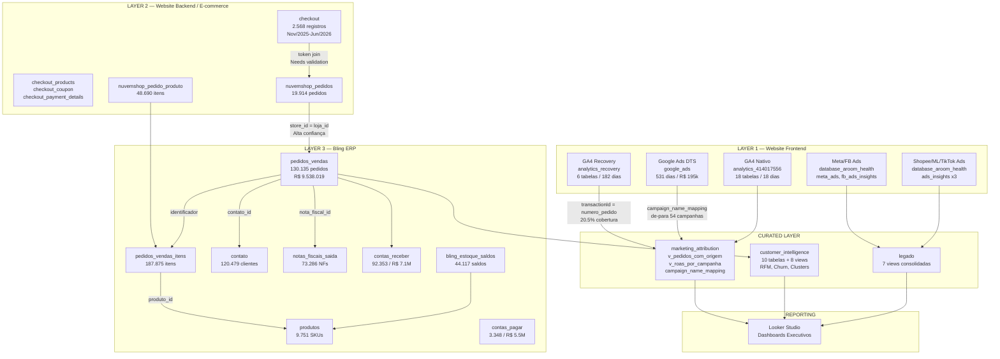

# Aroom Health — Source Mapping Phase 1
**Data:** 22/06/2026 | **Projeto:** iron-rex-461220-g4 | **Modo:** READ ONLY

---

## 1. Executive Summary

O ambiente GCP da Aroom Health possui **11 datasets**, **~100 tabelas** e **~20 views** cobrindo três domínios principais: Frontend (GA4/Ads), Backend/E-commerce (Nuvemshop/Checkout) e ERP (Bling). A fonte de verdade financeira é o Bling com **R$ 9.538.019** em receita auditada. A cobertura de atribuição GA4→Bling é **~20,5%** dos pedidos.

---

## 2. Dataset Inventory

| Dataset | Domínio | Fonte | Tabelas | Views | Propósito |
|:---|:---|:---|:---:|:---:|:---|
| `analytics_414017556` | Website Frontend | GA4 Nativo | 18 | 0 | Eventos diários GA4 (18 dias: Nov/2025–Jun/2026) |
| `analytics_recovery` | Website Frontend | GA4 API | 6 | 0 | GA4 histórico recuperado 182 dias (Dez/2025–Jun/2026) |
| `google_ads` | Marketing | DTS | 2 | 0 | Google Ads via Data Transfer Service (531 dias) |
| `database_aroom_health` | Backend + ERP | Bling + Nuvemshop | ~90 | 1 | Fonte operacional: pedidos, clientes, produtos, ads |
| `database_aroom_health_dev` | Governança | Dev | variado | 0 | Ambiente de desenvolvimento |
| `marketing_attribution` | Marketing | BigQuery (views) | 1 | 3 | Modelo ROAS: atribuição GA4→Bling |
| `legado` | Multi-domínio | BigQuery (views) | 0 | 7 | Views consolidadas do backlog |
| `customer_intelligence` | CRM | BigQuery | 10 | 8 | RFM, Churn, Clusters, Aquisição |
| `features` | ML | BigQuery | 1 | 0 | Features de clientes para ML |
| `ml` | ML | BigQuery | 1 | 0 | Segmentos de clientes |
| `wallet_for_marketing` | Marketing CRM | BigQuery | 1 | 2 | Cohorts e wallet de marketing |

---

## 3. As Três Camadas e Suas Relações

```
┌─────────────────────────────────────────────────────────────────┐
│  LAYER 1 — FRONTEND (Website / Comportamento Digital)           │
│                                                                 │
│  GA4 Nativo: analytics_414017556.events_YYYYMMDD               │
│  ├── 18 tabelas | Nov/2025 → Jun/2026                          │
│  ├── 141 eventos "purchase" (última semana)                    │
│  └── Eventos: page_view, session_start, add_to_cart,           │
│               form_submit, purchase, view_item                  │
│                                                                 │
│  GA4 Recovery: analytics_recovery.ga4_recovery_*               │
│  ├── 4.955 transações | R$ 512.023 | Dez/2025–Jun/2026         │
│  └── Top canais: Meta Paid (ig), Direct, Google PMax, TikTok   │
└──────────────────────┬──────────────────────────────────────────┘
                       │
          JOIN: transactionId (GA4) = numero_pedido (Bling)
          Confiança: MÉDIA | Cobertura: ~20,5% dos pedidos
                       │
┌──────────────────────▼──────────────────────────────────────────┐
│  LAYER 2 — BACKEND / E-COMMERCE (Site Próprio Nuvemshop)        │
│                                                                 │
│  database_aroom_health                                          │
│  ├── checkout              → 2.568 registros | Nov/2025–Jun/2026│
│  │   └── Carrinho abandonado + dados de entrega + email         │
│  ├── checkout_products     → itens no carrinho                  │
│  ├── checkout_payment_*    → métodos de pagamento               │
│  ├── checkout_coupon       → cupons aplicados                   │
│  ├── checkout_interaction_log → cliques e interações            │
│  ├── nuvemshop_pedidos     → 19.914 pedidos concluídos          │
│  │   └── customer_id, contact_email, payment_status             │
│  ├── nuvemshop_pedido_produto → 48.690 itens (produto × pedido) │
│  └── nuvemshop_cupom       → cupons configurados                │
└──────────────────────┬──────────────────────────────────────────┘
                       │
          JOIN: store_id (Nuvemshop) = loja_id (Bling)
          Canal Bling: "Site Aroom" (loja_id 205519093)
          Confiança: ALTA | 23.841 pedidos / R$ 2.850.297
                       │
┌──────────────────────▼──────────────────────────────────────────┐
│  LAYER 3 — ERP BLING (Fonte de Verdade Financeira)              │
│                                                                 │
│  database_aroom_health                                          │
│  ├── pedidos_vendas        → 130.135 pedidos | R$ 9.538.019    │
│  │   └── identificador, numero, data, total, loja_id,          │
│  │       situacao_id, contato_id, nota_fiscal_id                │
│  ├── pedidos_vendas_itens  → 187.875 itens | R$ 9.054.613      │
│  ├── contato               → 120.479 clientes                   │
│  ├── produtos              → 9.751 SKUs                         │
│  ├── notas_fiscais_saida   → 73.286 NFs | 2021–2026            │
│  ├── contas_receber        → 92.353 | R$ 7.145.571              │
│  ├── contas_pagar          → 3.348 | R$ 5.574.797               │
│  └── bling_estoque_saldos  → 44.117 saldos | 9.746 produtos     │
└─────────────────────────────────────────────────────────────────┘
```

---

## 4. Business Numbers por Fonte

### 4.1 Frontend — GA4

| Métrica | Valor | Período |
|:---|---:|:---|
| Tabelas de eventos nativas | 18 | Nov/2025 → Jun/2026 |
| Transações (ecommerce recovery) | 4.955 únicas | Dez/2025 → Jun/2026 |
| Receita rastreada GA4 | R$ 512.023 | idem |
| Eventos totais (recovery) | 529.625 page_views | idem |
| Add to cart | 55.970 | idem |
| Form submit | 44.432 | idem |
| Purchase (nativo - última semana) | 141 | Jun/2026 |

**Top canais GA4 (sessões):**

| Fonte | Meio | Sessões |
|:---|:---|---:|
| ig (Instagram) | paid | 29.452 |
| (direct) | (none) | 25.241 |
| google | cpc (PMax Sudeste) | 23.368 |
| google | cpc (PMax Fórmula) | 21.197 |
| ig | paid (campanha 2) | 20.140 |
| google | cpc (PMax Maçã) | 8.697 |
| google | organic | 7.849 |
| tiktok | video_ad | 6.905 |

---

### 4.2 Backend / E-commerce — Nuvemshop + Checkout

| Tabela | Volume | Período | Chave |
|:---|---:|:---|:---|
| `checkout` | 2.568 | Nov/2025–Jun/2026 | `identificador`, `token`, `store_id` |
| `checkout_products` | variado | idem | FK: checkout |
| `checkout_payment_details` | variado | idem | FK: checkout |
| `checkout_coupon` | variado | idem | FK: checkout |
| `checkout_interaction_log` | variado | idem | FK: checkout |
| `nuvemshop_pedidos` | 19.914 | histórico | `identificador`, `store_id`, `customer_id` |
| `nuvemshop_pedido_produto` | 48.690 | idem | FK: nuvemshop_pedidos |
| `nuvemshop_cupom` | variado | — | — |

> **Nota:** `checkout` = carrinhos (abandonados + convertidos). `nuvemshop_pedidos` = pedidos concluídos. A relação entre eles é via `token` ou `identificador`.

---

### 4.3 ERP Bling

| Tabela | Volume | Receita/Valor | Período |
|:---|---:|---:|:---|
| `pedidos_vendas` | 130.135 | R$ 9.538.019 | 2021–2026 |
| `pedidos_vendas_itens` | 187.875 | R$ 9.054.613 | idem |
| `contato` | 120.479 | — | 2025–2026 |
| `produtos` | 9.751 | — | — |
| `notas_fiscais_saida` | 73.286 | — | 2021–2026 |
| `contas_receber` | 92.353 | R$ 7.145.571 | 2024–2027 |
| `contas_pagar` | 3.348 | R$ 5.574.797 | 2023–2027 |
| `bling_estoque_saldos` | 44.117 | — | snapshot atual |

**Receita por ano:**

| Ano | Pedidos | Receita |
|:---|---:|---:|
| 2021 | 8 | R$ 983 |
| 2022 | 1.880 | R$ 115.915 |
| 2023 | 1.492 | R$ 121.014 |
| 2024 | 26.986 | R$ 1.971.463 |
| 2025 | 74.694 | R$ 5.199.996 |
| 2026 (parcial) | 25.073 | R$ 2.128.645 |

**Receita por canal:**

| Canal | Pedidos | Receita |
|:---|---:|---:|
| Site Aroom (Nuvemshop) | 23.841 | R$ 2.850.297 |
| Shopee (loja 1) | 37.758 | R$ 1.971.229 |
| Mercado Livre - Aroom Oficial | 15.969 | R$ 1.100.539 |
| Aroom Mercado Full | 11.999 | R$ 759.463 |
| Mercado Livre - Aroom 2 | 9.480 | R$ 606.543 |
| Beleza na Web | 9.550 | R$ 800.682 |
| Amazon | 4.576 | R$ 289.080 |
| Shopee (demais) | 4.856 | R$ 250.276 |
| Loja Raia | 3.854 | R$ 247.341 |
| Outros (20+ canais) | ~10.000 | R$ ~600.000 |

---

### 4.4 Marketing — Ads (investimento)

| Canal | Linhas | Investimento | Período |
|:---|---:|---:|:---|
| Facebook Ads (legado) | 1.861 | R$ 212.783 | Jan/2025–Jun/2026 |
| Google Ads (DTS) | 6.807 | R$ 195.069 | Jan/2025–Jun/2026 |
| Google Ads (legado) | 3.418 | R$ 117.610 | Mai/2024–Dez/2025 |
| Meta Ads | 1.798 | R$ 96.015 | Jun/2025–Jul/2025 |
| Shopee Ads | 280 | R$ 49.243 | Jan/2026–Jun/2026 |
| Mercado Livre Ads | 362 | R$ 20.478 | Jan/2026–Jun/2026 |
| TikTok Ads | 30 | R$ 1.368 | Mar/2026–Abr/2026 |

> **Risco:** Facebook Ads (legado) e Meta Ads cobrem períodos diferentes e possivelmente se sobrepõem. Needs validation se representam o mesmo canal ou pipelines separados.

---

## 5. Mapa de Relacionamentos

| Join | Tabela Fonte | Tabela Destino | Chave | Confiança | Risco |
|:---|:---|:---|:---|:---|:---|
| GA4 → Bling | `ga4_recovery_ecommerce.transactionId` | `pedidos_vendas.numero` | `transactionId = CAST(numero AS STRING)` | MÉDIA | 20,5% cobertura — 79,5% dos pedidos sem rastreamento |
| GA4 → Google Ads | `ga4_recovery_traffic_sources.sessionCampaignName` | `campaign_name_mapping.utm_campaign` | string match | ALTA | De-para com 54 mapeamentos resolvido |
| Nuvemshop → Bling | `nuvemshop_pedidos.store_id` | `pedidos_vendas.loja_id` | `store_id = loja_id` | ALTA | Confirmado: 23.841 pedidos / R$ 2.85M |
| Checkout → Nuvemshop | `checkout.token` | `nuvemshop_pedidos.token` | `token = token` | MÉDIA | Needs validation — checkout inclui abandonados |
| Bling Pedido → Itens | `pedidos_vendas.identificador` | `pedidos_vendas_itens.pedido_id` | `identificador = pedido_id` | ALTA | Fan-out já mitigado na view principal |
| Bling Pedido → NF | `pedidos_vendas.nota_fiscal_id` | `notas_fiscais_saida.identificador` | `nota_fiscal_id = identificador` | ALTA | 73.286 NFs vs 130.135 pedidos — cobertura parcial |
| Bling Pedido → Cliente | `pedidos_vendas.contato_id` | `contato.identificador` | `contato_id = identificador` | ALTA | 120.479 clientes |
| Bling Item → Produto | `pedidos_vendas_itens.produto_id` | `produtos.identificador` | `produto_id = identificador` | ALTA | 9.751 produtos |

---

## 6. Arquitetura Atual



---

## 7. Source Health Matrix

| Fonte | Status | Cobertura Temporal | Completude | Risco |
|:---|:---:|:---|:---|:---|
| GA4 Nativo | 🟡 Parcial | Apenas 18 dias | Alta para comportamento, baixa para transações | Gap histórico pré-Nov/2025 |
| GA4 Recovery | ✅ Ativo | 182 dias (Dez/2025–Jun/2026) | 20,5% dos pedidos com rastreamento | Cobertura baixa por AdBlock/cookie |
| Google Ads DTS | ✅ Ativo | 531 dias (Jan/2025–Jun/2026) | Alta | De-para resolvido |
| Meta Ads | 🟡 Parcial | Jun–Jul/2025 apenas | Baixa (só 53 dias) | Descontinuado ou pipeline parou |
| Facebook Ads (legado) | 🟡 Duplicado? | Jan/2025–Jun/2026 | — | Sobreposição com meta_ads — Needs validation |
| Shopee Ads | ✅ Ativo | Jan–Jun/2026 | Média | Sem campanha granular |
| ML Ads | ✅ Ativo | Jan–Jun/2026 | Média | Sem campanha granular |
| TikTok Ads | 🔴 Incompleto | Mar–Abr/2026 (30 dias) | Muito baixa | Pipeline desconectado? |
| Checkout | 🟡 Parcial | Nov/2025–Jun/2026 | — | Sem join validado com pedidos convertidos |
| Nuvemshop Pedidos | ✅ Ativo | Histórico | Alta | Join com Bling confirmado |
| Bling ERP | ✅ Fonte de Verdade | 2021–2026 | Alta | Referência financeira |
| Notas Fiscais | 🟡 Parcial | 2021–2026 | 56% dos pedidos têm NF | 44% sem nota emitida — Needs validation |
| customer_intelligence | ✅ Ativo | Derivado do Bling | — | Dependente da view principal |

---

## 8. Key Risks

| # | Risco | Severidade | Impacto |
|:---|:---|:---:|:---|
| R-01 | **Cobertura GA4 = 20,5%.** 79,5% dos pedidos sem origem digital rastreada. | 🔴 Alta | ROAS subestimado em ~5x |
| R-02 | **Meta Ads vs Facebook Ads Insights.** Dois pipelines para o mesmo canal com períodos diferentes. Possível duplicação de investimento reportado. | 🔴 Alta | Investimento Meta inflado |
| R-03 | **TikTok Ads: apenas 30 linhas (Mar–Abr/2026).** Pipeline provavelmente desconectado. | 🟡 Média | Custo TikTok não rastreado |
| R-04 | **Checkout → Nuvemshop join não validado.** Não confirmado se `token` é a chave correta. Taxa de conversão checkout→pedido desconhecida. | 🟡 Média | Funil de conversão incalculável |
| R-05 | **44% dos pedidos sem nota fiscal.** `pedidos_vendas` tem 130k pedidos; `notas_fiscais_saida` tem 73k NFs. Lacuna fiscal não explicada. | 🟡 Média | DRE fiscal incompleto |
| R-06 | **GA4 Nativo: apenas 18 dias.** Tabelas `events_*` existem de Nov/2025. Falta de dados históricos limita análise de tendência. | 🟡 Média | Análise YoY impossível via GA4 nativo |
| R-07 | **`contas_receber` com datas até 2027.** Possível dado futuro (parcelamentos) sendo contabilizado como receita. | 🟡 Média | Distorção no DRE |
| R-08 | **`contato` criado a partir de Fev/2025.** 120k clientes sem dados anteriores. Clientes de 2021–2024 ausentes ou em tabela diferente. | 🟠 Baixa | Histórico de clientes incompleto |

---

## 9. Open Questions

1. **Meta Ads vs Facebook Ads Insights:** São o mesmo pipeline ou fontes diferentes? Há sobreposição de datas?
2. **Checkout `token`:** É a chave de join com `nuvemshop_pedidos.token`? Qual a taxa de conversão carrinho→pedido?
3. **44% pedidos sem NF:** São pedidos cancelados? Ou NFs emitidas em outro sistema?
4. **`contas_receber` até 2027:** São parcelamentos futuros? Devem ser excluídos do DRE por competência?
5. **`contato` sem dados pré-2025:** Clientes de 2021–2024 estão em outra tabela?
6. **TikTok Ads pipeline:** Por que apenas 30 registros? Está desconectado?
7. **GA4 Nativo < Nov/2025:** Houve troca de propriedade GA4 ou migração?

---

## 10. Recommended Phase 2 Scope

### Prioridade Alta
1. **Validar join Checkout → Nuvemshop** via `token` e calcular taxa de conversão carrinho→pedido.
2. **Unificar Meta Ads + Facebook Ads Insights** em uma view sem duplicação de investimento.
3. **Investigar gap de NF:** Por que 44% dos pedidos não têm nota fiscal emitida?

### Prioridade Média
4. **Reconectar TikTok Ads** — pipeline desconectado desde Abr/2026.
5. **Construir funil completo:** GA4 (sessão) → Checkout → Nuvemshop Pedido → Bling.
6. **Validar `contas_receber` com vencimento 2027** — excluir parcelas futuras do DRE.

### Prioridade Baixa
7. **Ampliar cobertura GA4** via Conversions API / server-side tagging para aumentar de 20,5% para 60%+.
8. **Resolver `contato` histórico** — resgatar clientes de 2021–2024.
