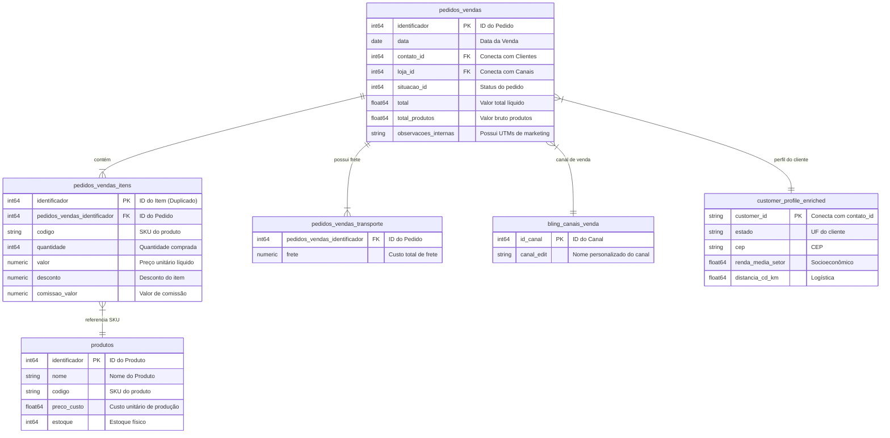

# Auditoria de Implementação do Ecossistema de BI & Modelagem Semântica

Este documento apresenta a auditoria técnica de conformidade do ecossistema de dados da **Aroom Health** em relação ao blueprint técnico, identificando lacunas (gaps), propondo a modelagem de rentabilidade, regras de atribuição de marketing e o design da camada semântica unificada no BigQuery.

---

## 1. Auditoria de Conformidade & Análise de Lacunas (Gap Analysis)

Abaixo, confrontamos a arquitetura ideal descrita no blueprint com a implementação física encontrada no BigQuery:

| Camada do Ecossistema | Requisito Ideal (Blueprint) | Estado Atual no BigQuery | Status | Lacuna Identificada (Gap) |
| :--- | :--- | :--- | :---: | :--- |
| **Ingestão (Raw)** | Ingestão diária de Bling, GA4 e Google Ads. | Bling e GA4 ativos. Google Ads paralisado desde 12/12/2025. | `⚠️ Parcial` | Pipeline do Google Ads quebrado. Falta de monitoramento automático de falhas. |
| **Transformação** | Modelagem robusta estilo dbt/Dataform. | Camada de views nativas simples baseadas em joins e CTEs. | `⚠️ Parcial` | Sem ferramenta de orquestração (Dataform/dbt). Sem controle de testes automatizados de chaves primárias. |
| **Inteligência** | Perfis de clientes enriquecidos com dados socioeconômicos. | Tabela `customer_profile_enriched` preenchida com coordenadas e IBGE. | `✅ OK` | A tabela existe e está saudável, porém não é ativamente cruzada com a view semântica de marketing. |
| **Semântica (BI)** | Camada que une margem, frete, UTMs de marketing e clientes. | A view `growth_engine_vendas_detalhado` une vendas, frete rateado e cliente, mas carece de UTMs. | `⚠️ Parcial` | Ausência de campos de UTM extraídos na view de produção. Impossibilidade atual de calcular ROAS real por campanha. |
| **Visualização** | Dashboards executivos de faturamento e ROAS no Looker. | Dashboard de faturamento funcional (~R$ 9.54M). Dashboard de marketing incorreto. | `⚠️ Parcial` | KPIs de tráfego pago e custo de aquisição (CAC) estão congelados ou incorretos desde dezembro de 2025. |

---

## 2. Diagrama de Modelagem Lógica (Data Model Diagram)

O diagrama abaixo descreve a relação física entre as tabelas brutas de ingestão e as dimensões enriquecidas:



---

## 3. Modelo de DRE / Rentabilidade por Item (Profitability Model)

Para calcular a lucratividade real de ponta a ponta (do custo de aquisição ao lucro líquido por SKU e campanha), desenhamos a seguinte estrutura lógica de cálculo na camada de transformação:

### Definições de Cálculo:
1. **Receita Bruta (Gross Revenue):** `quantidade * valor`
2. **Receita Líquida (Net Revenue):** `(quantidade * valor) - desconto`
3. **Custo dos Produtos Vendidos (COGS):** `quantidade * preco_custo`
4. **Comissão (Commission):** `comissao_valor`
5. **Frete Rateado (Freight Cost):** Rateio proporcional ao valor do item:
   `frete_total * (receita_liquida_item / soma_receita_liquida_pedido)`
6. **Margem de Contribuição (Contribution Margin):** `Receita Líquida - COGS - Comissão - Frete Rateado`
7. **Lucro por SKU/Pedido:** `Margem de Contribuição - Rateio de Outras Despesas`

### Consulta SQL Proposta para Rentabilidade Detalhada:
```sql
WITH valor_produtos_pedido AS (
    SELECT 
        pedidos_vendas_identificador as pedido_id,
        SUM((valor * quantidade) - desconto) as soma_receita_liquida_produtos
    FROM `iron-rex-461220-g4.database_aroom_health.pedidos_vendas_itens`
    GROUP BY pedidos_vendas_identificador
),
frete_pedido AS (
    SELECT 
        pedidos_vendas_identificador as pedido_id,
        MAX(frete) as frete_total
    FROM `iron-rex-461220-g4.database_aroom_health.pedidos_vendas_transporte`
    GROUP BY pedidos_vendas_identificador
)
SELECT 
    p.identificador as pedido_id,
    i.identificador as item_id,
    prod.codigo as sku,
    prod.nome as produto,
    i.quantidade as quantidade_vendida,
    
    -- Receitas
    (i.valor * i.quantidade) as receita_bruta,
    ((i.valor * i.quantidade) - i.desconto) as receita_liquida,
    
    -- Custos Diretos
    (COALESCE(prod.preco_custo, 0) * i.quantidade) as custo_cogs,
    COALESCE(i.comissao_valor, 0) as custo_comissao,
    
    -- Rateio de Frete
    CASE 
        WHEN vp.soma_receita_liquida_produtos > 0 THEN 
            COALESCE(f.frete_total, 0) * (((i.valor * i.quantidade) - i.desconto) / vp.soma_receita_liquida_produtos)
        ELSE 0 
    END as custo_frete_rateado,
    
    -- Margem de Contribuicao
    (((i.valor * i.quantidade) - i.desconto) 
     - (COALESCE(prod.preco_custo, 0) * i.quantidade) 
     - COALESCE(i.comissao_valor, 0) 
     - (CASE WHEN vp.soma_receita_liquida_produtos > 0 THEN COALESCE(f.frete_total, 0) * (((i.valor * i.quantidade) - i.desconto) / vp.soma_receita_liquida_produtos) ELSE 0 END)
    ) as margem_contribuicao

FROM `iron-rex-461220-g4.database_aroom_health.pedidos_vendas` p
JOIN `iron-rex-461220-g4.database_aroom_health.pedidos_vendas_itens` i 
    ON p.identificador = i.pedidos_vendas_identificador
LEFT JOIN `iron-rex-461220-g4.database_aroom_health.produtos` prod 
    ON i.produto_id = prod.identificador
LEFT JOIN valor_produtos_pedido vp ON p.identificador = vp.pedido_id
LEFT JOIN frete_pedido f ON p.identificador = f.pedido_id
WHERE p.situacao_id NOT IN (12, 105);
```

---

## 4. Estratégia de Atribuição de Marketing & Modelo de ROAS

A inatividade do pipeline do Google Ads impede o cálculo do ROAS atualizado. A estratégia para reestruturar esse cálculo envolve duas vertentes:

### A. Correção da Ingestão de Custos
* Reativação via BigQuery Data Transfer Service para centralizar os custos diários de anúncios por campanha (`google_ads.campaign_performance`).

### B. Extração de UTMs na View de Vendas
Implementação de regras de Regex sobre o campo `observacoes_internas` na tabela `pedidos_vendas` (Bling) para extrair a campanha de origem do pedido.

* **Exemplo de Expressão SQL para Extração de Parâmetros UTM:**
  ```sql
  SELECT
      p.identificador as pedido_id,
      REGEXP_EXTRACT(p.observacoes_internas, r'utm_source=([^&|\s\]]+)') as utm_source,
      REGEXP_EXTRACT(p.observacoes_internas, r'utm_medium=([^&|\s\]]+)') as utm_medium,
      REGEXP_EXTRACT(p.observacoes_internas, r'utm_campaign=([^&|\s\]]+)') as utm_campaign,
      REGEXP_EXTRACT(p.observacoes_internas, r'utm_content=([^&|\s\]]+)') as utm_content
  FROM `iron-rex-461220-g4.database_aroom_health.pedidos_vendas` p
  ```
  *(Nota: Se o checkout gravar as UTMs no padrão `utm_source=val&utm_medium=val`, a regex acima extrairá cada valor de forma individualizada e normalizada).*

---

## 5. Camada de Inteligência do Cliente (Socioeconômica & Logística)

A tabela `customer_profile_enriched` está totalmente apta para suportar decisões corporativas e otimizações logísticas de ponta a ponta:

1. **Segmentação de Margem por Perfil de Renda (`renda_media_setor`):**
   * Permite descobrir se bairros/setores de alta renda compram produtos de maior valor unitário (High Ticket) ou compram mais recorrentemente.
2. **Otimização de Frete Preditivo (`distancia_cd_km` vs. `custo_frete`):**
   * Cruza a distância real calculada em quilômetros até o Centro de Distribuição com o custo real de frete cobrado. Permite prever o custo de frete para expansões ou novos CDs regionais.
3. **Targeting de Campanhas baseadas no IDH Municipal (`idh_municipio`):**
   * Apoia a equipe de Growth a otimizar a distribuição do orçamento de publicidade (Google Ads/Meta Ads) direcionando anúncios apenas para localizações com alto IDH ou alta renda.

---

## 6. Design da Camada Semântica Unificada

A camada semântica final ideal consistirá em uma única view analítica consolidada chamada `customer_intelligence.growth_engine_marketing_vendas_consolidado`. 

Essa view conectará:
1. **Origem de Marketing (UTMs):** Extraídas via regex do Bling ou correlacionadas com sessões do GA4.
2. **Custos Publicitários:** Consumo diário do Google Ads.
3. **Faturamento Transacional e DRE:** Receita líquida, COGS, Frete Rateado e Margem de Contribuição por item.
4. **Contexto de Clientes:** Enriquecimento socioeconômico e localidade do cliente.
5. **Logística:** Distância física e eficiência logística.

### Estrutura Semântica Proposta:

```mermaid
graph TD
    subgraph Camada Semantica [customer_intelligence.growth_engine_marketing_vendas_consolidado]
        UTM[Origem de Marketing]
        Sales[Rentabilidade e Vendas]
        Socio[Socioeconômico IBGE]
        Log[Custos e Margem Logística]
    end

    UTM --> Sales
    Sales --> Socio
    Sales --> Log

    Looker[Dashboard Looker Studio] <-- Camada Semantica
```

---

## 7. Cronograma e Roadmap de Implantação Priorizado

### 🚀 Sprint 1: Restabelecimento e Recuperação (Dias 1 a 7)
* **Ação:** Ativar o BigQuery Data Transfer Service para Google Ads e rodar backfill completo desde 12/12/2025.
* **Meta:** Reestabelecer a atualização diária de dados de custo de marketing no Looker Studio.

### 🚀 Sprint 2: Rastreamento e Atribuição (Dias 7 a 20)
* **Ação:** Configurar a injeção de UTMs no checkout e implementar as queries de extração por regex na view de staging do BigQuery.
* **Meta:** Habilitar colunas de UTM e primeiro modelo de ROAS ao nível de pedido em homologação.

### 🚀 Sprint 3: Rentabilidade e Custos (Dias 20 a 35)
* **Ação:** Criar a modelagem DRE / Rentabilidade de item pro-rata (COGS, comissões, frete proporcional e margem de contribuição).
* **Meta:** Entregar a view de rentabilidade auditada pronta para conexões no Looker Studio.

### 🚀 Sprint 4: Orquestração e Inteligência (Dias 35 a 60)
* **Ação:** Configurar o Dataform para orquestrar e testar as transformações analíticas automaticamente no GCP. Integrar as métricas socioeconômicas do IBGE e distâncias logísticas.
* **Meta:** Garantir governança de código de ponta a ponta e auditorias automáticas de chaves primárias e faturamento diário.
