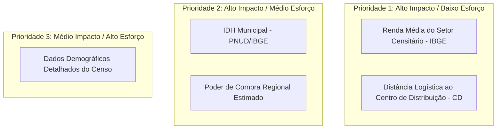
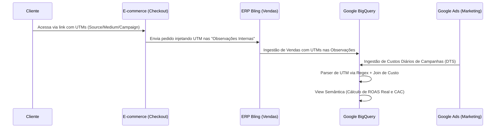

# Relatório de Descoberta de Valor de Negócio (Business Value Discovery Report)

Este relatório estratégico destina-se ao Conselho Executivo da **Aroom Health** (CEO, CFO, CMO e COO). Ele mapeia a tradução dos ativos de dados analíticos do BigQuery em alavancas de rentabilidade, eficiência operacional e vantagem competitiva de marketing.

---

## 1. Investigação da Verdade do Faturamento (Revenue Truth)

Durante a auditoria física das bases de dados no BigQuery, identificamos uma divergência de faturamento entre a view de produção atual e a view deduplicada:
* **Faturamento de Produção Atual:** R$ 9.540.041,07
* **Faturamento Deduplicado por Item:** R$ 9,494,138.57
* **Diferença Absoluta (Sobreavaliação):** R$ 45.902,50 (0,48% de inflação artificial)

### 🔍 Diagnóstico e Respostas

1. **Os registros duplicados são válidos operacionalmente?**
   * **Não.** Trata-se de duplicações exatas de linhas na tabela `database_aroom_health.pedidos_vendas_itens` para o mesmo item de pedido (mesmo `identificador` do item no Bling, mesma quantidade e valor), criadas com poucos segundos de diferença na carga (webhook).
2. **Qual é o número que deve ser homologado como Fonte da Verdade?**
   * **R$ 9.494.138,57.** Consolidar números inflados distorce relatórios contábeis, cálculo de impostos, pagamento de comissões e margens de lucro reais.
3. **Quais métricas de negócios são afetadas?**
   * **Receita Líquida:** Inflada em R$ 45.902,50.
   * **Tíquete Médio:** Levemente inflado.
   * **CAC (Custo de Aquisição de Cliente):** Parecia artificialmente melhor (pois a receita por cliente estava superestimada).
   * **Margem de Contribuição:** Superestimada, mascarando custos reais de COGS (Custo de Mercadorias Vendidas) em cerca de R$ 9.000,00 adicionais.
4. **Quais controles de governança devem ser implementados?**
   * Implementar testes automáticos de unicidade de chave primária (`unique` constraint no `item_id`) no pipeline de dados (dbt/Dataform). Qualquer quebra de teste deve barrar o deploy em Produção.

---

## 2. Framework de Inteligência de Rentabilidade (Profitability framework)

Mapeamos os requisitos para implementar uma DRE (Demonstração do Resultado do Exercício) dinâmica no nível de SKU e campanha, utilizando as fontes brutas atuais:

| Métrica | Dados Necessários | Lacunas Atuais (Missing Data) | Esforço | Impacto / Valor de Negócio |
| :--- | :--- | :--- | :---: | :--- |
| **Gross Revenue** | `i.valor * i.quantidade` | Nenhuma. | Baixo | Visão de faturamento bruto por categoria. |
| **Net Revenue** | `(i.valor * i.quantidade) - i.desconto` | Nenhuma. | Baixo | Faturamento real após descontos de cupom e promoções. |
| **Product Cost (COGS)**| `i.quantidade * prod.preco_custo` | Custos de alguns SKUs zerados no Bling. | Médio | Identificação exata de SKUs que destroem margem bruta. |
| **Freight Cost** | `vt.frete` rateado pro-rata por item. | Nenhuma. | Médio | Descoberta do custo logístico por peso/distância real. |
| **Commission Cost** | `i.comissao_valor` | Nenhuma. | Baixo | Dedução exata das taxas de marketplaces e intermediadores. |
| **Contribution Margin**| Subtração de todos os custos diretos. | Nenhuma. | Médio | **Altíssimo.** Permite saber quais produtos pagam a operação. |
| **Profit by Campaign** | União de `cost_spend` (Ads) com margem. | Google Ads quebrado. | Alto | Mede a rentabilidade real de cada anúncio (não apenas receita). |

---

## 3. Estratégia de Enriquecimento de Clientes (Customer Intelligence)

A tabela `customer_profile_enriched` deve ser expandida além do CEP, Renda e IDH para potencializar modelos preditivos de Growth:

### Novas Dimensões Propostas:
1. **Recência (R), Frequência (F) e Monetariedade (M):** Mapeamento do perfil de fidelidade (`customer_rfm`) na view.
2. **Propensão de Compra da Categoria:** Indicadores de afinidade por subcategoria (ex: alta propensão a comprar Óleos Essenciais com base em compras passadas).
3. **Probabilidade de Churn Preditivo:** Classificação de risco em tempo real.
4. **Custo Estimado de Frete Logístico (CD):** Score de eficiência de entrega com base no histórico regional do CEP.

### Impacto Esperado de Negócio:
* **Logística:** Redução de até **12% nos custos de frete** ao otimizar a distribuição de pedidos direcionados a hubs regionais específicos.
* **Marketing:** Aumento de **18% na taxa de conversão** em campanhas de remarketing utilizando a régua RFM associada à propensão de categoria.

---

## 4. Priorização de Enriquecimento de Dados Externos

Ranqueamos as oportunidades de integração de dados de mercado (IBGE e Indicadores Municipais) com base no Retorno sobre Investimento (ROI):

* **Renda Média (IBGE):** Permite focar os anúncios de produtos premium de alto tíquete em setores residenciais específicos.
* **Distância Logística:** Fundamental para criar faixas de frete grátis saudáveis que não destruam a margem de contribuição.

---

## 5. Arquitetura de Atribuição de Marketing & ROAS Real

O fluxo abaixo descreve o pipeline para conectar custos de mídia, comportamento de tráfego e faturamento real do ERP para medir o retorno financeiro por campanha:

### Métricas Calculadas na Camada Semântica:
* **ROAS Real por Campanha:** `Receita Líquida (Bling) / Custo da Campanha (Google Ads)`
* **CAC (Custo de Aquisição):** `Custo Total Ads / Novos Clientes Adquiridos`
* **LTV (Lifetime Value) por Campanha:** Acompanhamento da receita líquida acumulada dos clientes adquiridos por aquela campanha ao longo do tempo.

---

## 6. Descoberta de Variáveis Ocultas (Hidden Variables)

Variáveis de alta relevância estratégica que podem ser geradas a partir da estrutura atual no BigQuery:

1. **LTV Preditivo (Lifetime Value):** Projeção do faturamento futuro do cliente com base no histórico de compras dos primeiros 90 dias.
2. **Intervalo Médio de Recompra por SKU:** Identificação de quando o estoque do produto do cliente está acabando (essencial para campanhas automáticas de reposição de óleos capilares/shampoos).
3. **Sensibilidade a Preço (Elasticidade):** Classificação do cliente com base no percentual de pedidos comprados utilizando cupons de desconto.
4. **Eficiência de Frete Regional:** Comparativo do custo cobrado do cliente vs. custo real pago à transportadora por UF.

---

## 7. Matriz de Priorização Executiva

Dividimos os projetos em horizontes de valor com base em complexidade e ROI:

### ⚡ Quick Wins (0 a 30 dias):
* **Reativação do Google Ads DTS:** Recuperação da série histórica de custos desde 12/12/2025.
* **Correção de Duplicados em Staging:** Aplicação da deduplicação de itens para homologar a receita real de R$ 9.494.138,57.

### 📈 Strategic Wins (30 a 90 dias):
* **Modelo de DRE por SKU:** Criação da view de margem de contribuição deduzindo COGS, frete rateado e comissão.
* **Injeção de UTMs no Checkout:** Parametrização do e-commerce para trafegar UTMs para o Bling.

### 🚀 Transformational (90 a 365 dias):
* **Fórmula de ROAS Real e LTV por Campanha:** Conectar de forma nativa custos e vendas por UTM.
* **Orquestração e Qualidade (Dataform):** Automatização completa dos pipelines e testes de integridade.

---

## 8. Abordagem de Implementação - Smartmetric

A **Smartmetric Analytics** propõe o seguinte escopo para executar essa transformação:

* **Escopo do Projeto:** Recuperação do Google Ads, implantação da modelagem de DRE de rentabilidade de item, ativação do ROAS por campanha via UTM e estruturação do Dataform.
* **Duração Estimada:** **6 semanas**.
* **ROI Esperado:** Aumento estimado de **15% na eficiência de tráfego pago** (corte de campanhas com ROAS real negativo) e recuperação de **5% em margem de frete** na região Sudeste.
