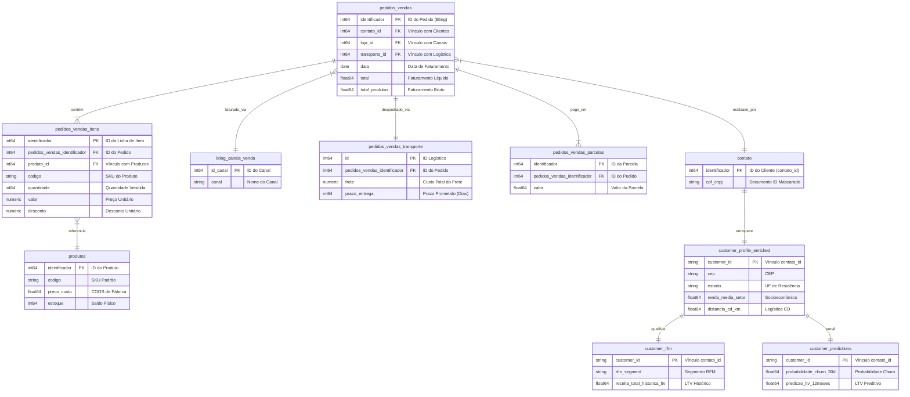

# Catálogo de Relacionamentos e Associações de Dados
## Aroom Health BI Engine - Governança e Regras de Integridade de Joins

Este catálogo mapeia as conexões relacionais lógicas e físicas entre as tabelas do BigQuery, definindo chaves primárias (PK), chaves estrangeiras (FK), cardinalidades recomendadas e os mecanismos de mitigação do risco de explosão de dados (fan-out).

---

## 1. Diagrama de Relacionamento Entidade-Associação (ERD)

O diagrama abaixo apresenta o modelo físico e lógico do banco de dados, dividindo os fluxos de faturamento, canais, logística, dados demográficos censitários (IBGE) e as previsões de inteligência de clientes.



---

## 2. Dicionário de Chaves Relacionais

Esta seção detalha as chaves de ligação relacional físicas e lógicas recomendadas para joins entre tabelas no BigQuery.

### 2.1 Chaves Primárias Candidatas (PK)

*   **`database_aroom_health.pedidos_vendas`**: `identificador`. 
    *   *Tipo:* INT64.
    *   *Validação de Unicidade:* Contém 2 registros duplicados na carga do ERP. Requer filtro deduplicado no staging antes do consumo.
*   **`database_aroom_health.pedidos_vendas_itens`**: `identificador`.
    *   *Tipo:* INT64.
    *   *Validação de Unicidade:* Contém 895 registros duplicados (fan-out por webhook). A chave primária de staging recomendada é a combinação composta `pedidos_vendas_identificador` + `identificador` + `produto_id` ou o uso de `ROW_NUMBER()`.
*   **`database_aroom_health.produtos`**: `identificador`.
    *   *Tipo:* INT64.
    *   *Validação de Unicidade:* Contém 2 duplicatas no cadastro do ERP.
*   **`customer_intelligence.customer_profile_enriched`**: `customer_id`.
    *   *Tipo:* STRING.
    *   *Validação de Unicidade:* 100% único. Representa a granularidade consolidada de um cliente único.
*   **`google_ads_campaign_performance`**: Chave composta `campaign_name` + `day`.
    *   *Tipo:* STRING + DATE.
    *   *Validação de Unicidade:* Chave lógica obrigatória para consolidações diárias de publicidade.
*   **`google_analytics_utm_daily`**: Chave composta `metric_date` + `session_source` + `session_medium` + `session_campaign_name`.
    *   *Tipo:* DATE + STRING + STRING + STRING.
    *   *Validação de Unicidade:* Chave lógica para consolidação de tráfego.

### 2.2 Chaves Estrangeiras (FK) e Mapeamentos

*   **`pedidos_vendas.contato_id` -> `contato.identificador`**
    *   *Regra de Ligação:* Conecta os pedidos transacionais aos dados cadastrais e ao perfil do cliente. Tipo de join recomendado: `INNER JOIN` (para remover pedidos sem clientes atrelados) ou `LEFT JOIN` (para auditar órfãos).
*   **`pedidos_vendas.loja_id` -> `bling_canais_venda.id_canal`**
    *   *Regra de Ligação:* Vínculo do pedido com a tabela de canais (Shopee, Mercado Livre, Nuvemshop). Requer conversão explícita de tipos: `CAST(loja_id AS STRING) = id_canal`.
*   **`pedidos_vendas_itens.produto_id` -> `produtos.identificador`**
    *   *Regra de Ligação:* Join para obter o preço de custo unitário (`preco_custo`) e nome do produto. Deve ser `LEFT JOIN` para garantir que vendas de produtos sem cadastro atualizado no Bling não sumam do faturamento.
*   **`pedidos_vendas.identificador` -> `pedidos_vendas_transporte.pedidos_vendas_identificador`**
    *   *Regra de Ligação:* Conecta o cabeçalho do pedido ao seu custo de frete. Cardinalidade 1:1 lógica, porém sujeita a risco de multiplicação se ligada diretamente com itens.

---

## 3. Guia de Mitigação de Riscos de Explosão de Dados (Fan-out)

O fenômeno do **fan-out** (explosão de dados) ocorre quando uma junção relacional multiplica incorretamente o número de linhas originais ou as métricas de faturamento/custos, gerando discrepâncias graves nos dashboards executivos do Looker Studio. Mapeamos os três principais cenários de fan-out no ecossistema da Aroom Health e as respectivas soluções de engenharia:

### Cenário 1: Juntar Cabeçalho de Pedidos com Itens de Vendas
*   **A Situação:** A tabela `pedidos_vendas` possui 127.528 linhas (uma por pedido). A tabela `pedidos_vendas_itens` possui 183.719 linhas (uma por item).
*   **O Erro de Joins:** Se você juntar as duas tabelas diretamente e somar o campo `pedidos_vendas.total` (receita total do pedido), a receita de cada pedido será multiplicada pela quantidade de itens contidos nele. Um pedido de R$ 100 com 3 itens aparecerá nos relatórios como faturamento de R$ 300.
*   **Mecanismo de Mitigação:** 
    1.  *Regra Relacional:* Nunca realize operações de soma em colunas da tabela de cabeçalho (`pedidos_vendas`) após o join com itens.
    2.  *Solução SQL:* Calcule o faturamento somando exclusivamente os campos da tabela de itens (`pedidos_vendas_itens.valor * pedidos_vendas_itens.quantidade`) ou realize a agregação dos itens em nível de pedido dentro de uma CTE antes de ligar com o cabeçalho:
        ```sql
        WITH itens_agrupados AS (
            SELECT 
                pedidos_vendas_identificador,
                SUM((valor * quantidade) - desconto) AS total_produtos_calculado
            FROM `database_aroom_health.pedidos_vendas_itens`
            GROUP BY pedidos_vendas_identificador
        )
        SELECT 
            p.identificador,
            p.total,
            i.total_produtos_calculado
        FROM `database_aroom_health.pedidos_vendas` p
        LEFT JOIN itens_agrupados i ON p.identificador = i.pedidos_vendas_identificador;
        ```

### Cenário 2: Duplicação de Custos de Frete (Rateio Obrigatório)
*   **A Situação:** O custo do frete (`frete`) é declarado globalmente na tabela `pedidos_vendas_transporte` para todo o pedido.
*   **O Erro de Joins:** Ao juntar a tabela de transporte diretamente com os itens do pedido para calcular a margem de contribuição de cada SKU, o custo do frete total é imputado integralmente para cada item, multiplicando o custo real de frete pelo número de itens do pedido.
*   **Mecanismo de Mitigação:** Aplicar rateio de frete proporcional à receita líquida de cada item no pedido:
    ```sql
    -- Formula de Rateio Proporcional
    custo_frete_rateado = frete_total * (receita_liquida_item / total_receita_liquida_produtos_pedido)
    ```

### Cenário 3: Duplicação de Clientes por Múltiplos Endereços
*   **A Situação:** Um cliente (`contato_id`) pode ter múltiplos endereços de entrega cadastrados ao longo do tempo na tabela `contato_endereco`.
*   **O Erro de Joins:** Ao fazer join de `pedidos_vendas` com endereços de clientes diretamente, as vendas do cliente serão duplicadas para cada endereço que ele possui.
*   **Mecanismo de Mitigação:** Criar uma CTE de endereços deduplicada na granularidade de cliente único utilizando funções de agregação (`ANY_VALUE` ou `ROW_NUMBER` com base na data de atualização mais recente) antes do join transacional.
