# Frontend Data Model — Aroom Health
**Versão:** 1.0 | **Data:** 22/06/2026 | **Modo:** READ ONLY — Phase 1

> Mapeamento completo do modelo de dados de todas as fontes digitais/frontend,
> seus campos, relacionamentos entre si e pontes para Backend (Nuvemshop/Checkout)
> e ERP (Bling).

---

## 1. Visão Geral — Fontes Frontend

```
SISTEMA          DATASET                           TABELAS
─────────────────────────────────────────────────────────────────────────
GA4 Nativo       analytics_414017556               events_YYYYMMDD (18 tabelas)
GA4 Recovery     analytics_recovery                ga4_recovery_* (6 tabelas)
GA4 Agregado     database_aroom_health             google_analytics_daily
                                                   google_analytics_event_daily
                                                   google_analytics_revenue_channel_daily
                                                   google_analytics_utm_daily
Email CRM        database_aroom_health             perfit_campaign_actions
                                                   perfit_campaign_metrics
                                                   dispatch_send_log
Chatbot          database_aroom_health             chatbot_session
                                                   chatbot_message
```

---

## 2. Modelo de Dados por Sistema

---

### 2.1 GA4 Nativo — `analytics_414017556.events_YYYYMMDD`

**Tipo:** Tabela particionada por data (1 tabela por dia)  
**Cobertura:** 18 dias (Nov/2025 → Jun/2026)  
**Grain:** 1 linha = 1 evento de 1 usuário

#### Schema principal

| Campo | Tipo | Descrição |
|:---|:---|:---|
| `event_date` | STRING | Data do evento (YYYYMMDD) |
| `event_timestamp` | INT64 | Microsegundos epoch |
| `event_name` | STRING | Nome do evento (`purchase`, `add_to_cart`, `page_view`…) |
| `event_params` | ARRAY\<STRUCT\> | Parâmetros do evento (chave-valor) |
| `event_previous_timestamp` | INT64 | Timestamp do evento anterior |
| `user_id` | STRING | ID do usuário autenticado (raro em e-commerce) |
| `user_pseudo_id` | STRING | ID anônimo do dispositivo (cookie GA4) |
| `user_properties` | ARRAY\<STRUCT\> | Propriedades customizadas do usuário |
| `user_first_touch_timestamp` | INT64 | Primeiro contato do usuário |
| `user_ltv` | STRUCT | LTV acumulado do usuário |
| `device` | STRUCT | `{category, mobile_brand, os, browser, language}` |
| `geo` | STRUCT | `{country, region, city, sub_continent, metro}` |
| `app_info` | STRUCT | Info do app (mobile) |
| `traffic_source` | STRUCT | `{source, medium, name (campaign)}` — **atribuição de 1º toque** |
| `session_traffic_source_last_click` | STRUCT | Atribuição last-click com `manual_campaign.campaign_name`, `google_ads_campaign.*` |
| `stream_id` | STRING | ID do stream GA4 |
| `platform` | STRING | `WEB`, `IOS`, `ANDROID` |

#### Campos-chave extraídos de `event_params` (via UNNEST)

| Key | Valor típico | Relevância |
|:---|:---|:---|
| `transaction_id` | `"24137"` | **JOIN com Bling** `pedidos_vendas.numero` |
| `value` | `296.64` | Receita do pedido |
| `currency` | `"BRL"` | Moeda |
| `items` | ARRAY | Produtos comprados (SKU, nome, preço, quantidade) |
| `page_location` | URL completa | Página visitada |
| `page_title` | STRING | Título da página |
| `session_id` | STRING | ID da sessão |
| `engagement_time_msec` | INT64 | Tempo de engajamento |
| `search_term` | STRING | Busca realizada |

#### Eventos relevantes para funil

```
TOPO                          MEIO                     FUNDO
──────────────────────────────────────────────────────────────
first_visit                   view_item_list           begin_checkout
session_start                 view_item                add_shipping_info
page_view                     select_item              add_payment_info
                              add_to_cart              purchase  ← JOIN BLING
                              remove_from_cart         
                              search                   form_submit (lead)
                              view_cart
```

**Amostra de evento `purchase` (21/06/2026):**

| transaction_id | revenue | currency | source | medium | campaign |
|:---|---:|:---|:---|:---|:---|
| 24137 | NULL | BRL | meta | cpc_conversao_compra_todos | gp_aberto_m_auto-… |
| 24141 | 296.64 | BRL | ig | paid | 120246788551320703 |
| 24128 | 344.70 | BRL | google | cpc | pmax_roas_formula-exclusiva |
| 24129 | 40.75 | BRL | lm.facebook.com | referral | (referral) |

> **Risco:** `transaction_id` às vezes chega NULL mesmo no evento `purchase`. Necessita limpeza.

---

### 2.2 GA4 Recovery — `analytics_recovery.ga4_recovery_*`

**Tipo:** 6 tabelas flat (sem partição)  
**Cobertura:** 182 dias (11/12/2025 → 10/06/2026)  
**Origem:** Google Analytics Data API — dados históricos do gap

#### ga4_recovery_traffic_sources

| Campo | Tipo | Descrição |
|:---|:---|:---|
| `date` | DATE | Data do snapshot |
| `sessionSource` | STRING | Fonte da sessão (`google`, `ig`, `(direct)`…) |
| `sessionMedium` | STRING | Meio (`cpc`, `paid`, `organic`, `referral`…) |
| `sessionCampaignName` | STRING | Nome da campanha UTM — **JOIN com campaign_name_mapping** |
| `activeUsers` | INT64 | Usuários ativos únicos |
| `sessions` | INT64 | Total de sessões |
| `conversions` | INT64 | Conversões (purchase) |
| `eventCount` | INT64 | Total de eventos |
| `purchaseRevenue` | FLOAT64 | Receita de compra |

#### ga4_recovery_ecommerce ⭐ Tabela mais importante para atribuição

| Campo | Tipo | Descrição |
|:---|:---|:---|
| `date` | DATE | Data da transação |
| `sessionSource` | STRING | Fonte de origem da sessão |
| `sessionMedium` | STRING | Meio |
| `transactionId` | STRING | **ID do pedido → JOIN com Bling** `pedidos_vendas.numero` |
| `purchaseRevenue` | FLOAT64 | Receita da transação |

> **Bridge principal:** `transactionId` = `CAST(pedidos_vendas.numero AS STRING)`  
> **Cobertura:** 4.955 transações únicas / R$ 512.023 / 20,5% dos pedidos Bling

#### ga4_recovery_events

| Campo | Tipo | Descrição |
|:---|:---|:---|
| `date` | DATE | Data |
| `eventName` | STRING | Nome do evento |
| `eventCount` | INT64 | Contagem do evento |

#### ga4_recovery_pages

| Campo | Tipo | Descrição |
|:---|:---|:---|
| `date` | DATE | Data |
| `landingPage` | STRING | URL da landing page |
| `activeUsers` | INT64 | Usuários únicos |
| `sessions` | INT64 | Sessões iniciadas |
| `screenPageViews` | INT64 | Visualizações de página |

#### ga4_recovery_geo

| Campo | Tipo | Descrição |
|:---|:---|:---|
| `date` | DATE | Data |
| `country` | STRING | País |
| `region` | STRING | Estado |
| `city` | STRING | Cidade |
| `activeUsers` | INT64 | Usuários ativos |
| `sessions` | INT64 | Sessões |

#### ga4_recovery_devices

| Campo | Tipo | Descrição |
|:---|:---|:---|
| `date` | DATE | Data |
| `deviceCategory` | STRING | `desktop`, `mobile`, `tablet` |
| `operatingSystem` | STRING | `Android`, `iOS`, `Windows`… |
| `activeUsers` | INT64 | Usuários ativos |
| `sessions` | INT64 | Sessões |

---

### 2.3 GA4 Pré-Agregado — `database_aroom_health.google_analytics_*`

**Tipo:** Tabelas flat, atualizadas diariamente via pipeline próprio  
**Cobertura:** Jan/2025 → Jun/2026 (18 meses)  
**Grain:** Agregado (não há `transactionId`)

#### google_analytics_daily ⭐ Funil completo diário

| Campo | Tipo | Descrição |
|:---|:---|:---|
| `id` | INT64 | PK |
| `metric_date` | DATE | Data — **JOIN por data** |
| `ga_property_id` | STRING | ID da propriedade GA4 |
| `active_users` | INT64 | Usuários ativos |
| `sessions` | INT64 | Sessões |
| `new_users` | INT64 | Novos usuários |
| `screen_page_views` | INT64 | Page views |
| `engaged_sessions` | INT64 | Sessões engajadas |
| `view_item_list` | INT64 | Visualizações de lista |
| `view_item` | INT64 | Visualizações de produto |
| `add_to_cart` | INT64 | Adições ao carrinho |
| `begin_checkout` | INT64 | Início de checkout |
| `add_shipping_info` | INT64 | Preenchimento de frete |
| `add_payment_info` | INT64 | Preenchimento de pagamento |
| `purchase` | INT64 | Eventos purchase (duplicado de `ecommerce_purchases`) |
| `ecommerce_purchases` | INT64 | Compras confirmadas |
| `purchase_revenue` | NUMERIC(14,2) | Receita de compra |
| `desktop` | INT64 | Sessões desktop |
| `mobile` | INT64 | Sessões mobile |
| `created_at` | DATETIME | Ingestão |
| `updated_at` | DATETIME | Última atualização |

> **Receita total:** R$ 1.682.913 / 16.236 transações (Jan/2025–Jun/2026)

#### google_analytics_revenue_channel_daily — Receita por canal

| Campo | Tipo | Descrição |
|:---|:---|:---|
| `id` | INT64 | PK |
| `metric_date` | DATE | Data |
| `ga_property_id` | STRING | Propriedade GA4 |
| `session_default_channel_group` | STRING | Canal GA4 (`Cross-network`, `Paid Social`, `Direct`…) |
| `purchase_revenue` | NUMERIC(14,2) | Receita do canal |
| `ecommerce_purchases` | INT64 | Transações do canal |
| `created_at` | DATETIME | Ingestão |
| `updated_at` | DATETIME | Última atualização |

#### google_analytics_utm_daily — Sessões por campanha UTM

| Campo | Tipo | Descrição |
|:---|:---|:---|
| `id` | INT64 | PK |
| `metric_date` | DATE | Data |
| `ga_property_id` | STRING | Propriedade GA4 |
| `session_source` | STRING | Fonte (`google`, `ig`, `facebook.com`…) |
| `session_medium` | STRING | Meio (`cpc`, `paid`, `organic`…) |
| `session_campaign_name` | STRING | Campanha UTM — **JOIN com campaign_name_mapping** |
| `session_campaign_id` | STRING | ID da campanha |
| `sessions` | INT64 | Sessões |
| `created_at` | DATETIME | Ingestão |
| `updated_at` | DATETIME | Última atualização |

#### google_analytics_event_daily — Eventos por dispositivo

| Campo | Tipo | Descrição |
|:---|:---|:---|
| `id` | INT64 | PK |
| `metric_date` | DATE | Data |
| `ga_property_id` | STRING | Propriedade GA4 |
| `event_name` | STRING | Nome do evento |
| `event_count` | INT64 | Contagem |
| `device_category` | STRING | `desktop`, `mobile`, `tablet` |

---

### 2.4 Email CRM — Perfit + Dispatch

#### perfit_campaign_actions ⭐ Bridge email → Bling via email

| Campo | Tipo | Descrição |
|:---|:---|:---|
| `id` | INT64 | PK |
| `campaign_id` | INT64 | FK → `perfit_campaign_metrics.campaign_id` |
| `campaign_name` | STRING | Nome da campanha de email |
| `action_type` | STRING | `SENT`, `OPEN`, `CLICK`, `UNSUBSCRIBE`, `HARD_BOUNCE`, `SOFT_BOUNCE`, `COMPLAINT` |
| `contact_email` | STRING | **JOIN com `contato.email`** (75% match = 4.994 clientes) |
| `contact_name` | STRING | Nome do contato |
| `action_at` | DATETIME | Data/hora da ação |
| `url` | STRING | URL clicada (quando CLICK) |
| `link_id` | STRING | ID do link clicado |
| `perfit_track_id` | STRING | ID de rastreamento Perfit |

**Distribuição de `action_type`:**

| Tipo | Volume | % |
|:---|---:|:---|
| SENT | 169.098 | 56,9% |
| OPEN | 121.071 | 40,7% |
| CLICK | 5.743 | 1,9% |
| UNSUBSCRIBE | 1.088 | 0,4% |
| HARD_BOUNCE | 331 | 0,1% |
| SOFT_BOUNCE | 94 | ~0% |

#### perfit_campaign_metrics — KPIs da campanha

| Campo | Tipo | Descrição |
|:---|:---|:---|
| `id` | INT64 | PK |
| `campaign_id` | INT64 | FK → `perfit_campaign_actions.campaign_id` |
| `campaign_name` | STRING | Nome da campanha |
| `snapshot_date` | DATE | Data do snapshot |
| `sent` | INT64 | Enviados |
| `sent_p` / `delivered_p` | NUMERIC | % de entrega |
| `opened` / `opened_p` | NUMERIC | Open rate |
| `clicked` / `clicked_p` | NUMERIC | CTR |
| `ctor` | NUMERIC | Click-to-open rate |
| `converted` / `converted_p` | NUMERIC | Taxa de conversão |
| `bounced_hard` / `bounced_soft` | INT64 | Bounces |
| `complained` / `unsubscribed` | INT64 | Spam/descadastros |
| `shared` / `shared_opened` / `shared_clicked` | INT64 | Compartilhamentos |

#### dispatch_send_log ⭐ Bridge DIRETA — FK nativa para Bling

| Campo | Tipo | Descrição |
|:---|:---|:---|
| `id` | INT64 | PK |
| `contact_id` | INT64 | **FK direta → `contato.identificador`** |
| `rule_tag` | STRING | Regra de automação acionada |
| `anchor_year` | INT64 | Ano âncora da automação |
| `anchor_date` | DATE | Data âncora |
| `sent_at` | DATETIME | Data/hora do envio |

**Regras de automação (`rule_tag`) ativas:**

| Regra | Ano | Envios |
|:---|:---|---:|
| `aniversario` | 2026 | 8.461 |
| `sinto_sua_falta_2` | — | 4.693 |
| `sinto_sua_falta` | — | 4.656 |
| `produto_acabando_cliente` | — | 4.566 |

---

### 2.5 Chatbot — `chatbot_session` + `chatbot_message`

#### chatbot_session

| Campo | Tipo | Descrição |
|:---|:---|:---|
| `id` | INT64 | PK |
| `chat_id` | STRING | ID externo da conversa |
| `visitor_name` | STRING | Nome do visitante |
| `email` | STRING | Email captado — **JOIN potencial com `checkout.contact_email`** |
| `phone` | STRING | Telefone captado |
| `device_type` | STRING | Tipo de dispositivo |
| `status` | STRING | `active`, `ended` |
| `created_at` | DATETIME | Início da sessão |
| `updated_at` | DATETIME | Última atualização |
| `ended_at` | DATETIME | Fim da sessão |

#### chatbot_message

| Campo | Tipo | Descrição |
|:---|:---|:---|
| `id` | INT64 | PK |
| `chat_session_id` | INT64 | **FK → `chatbot_session.id`** |
| `role` | STRING | `user` ou `assistant` |
| `content` | STRING | Conteúdo da mensagem |
| `created_at` | DATETIME | Timestamp |

---

## 3. Diagrama de Relacionamentos — Frontend

```mermaid
erDiagram

    %% GA4 NATIVO
    GA4_EVENTS {
        string event_date PK
        string event_name
        string user_pseudo_id
        array event_params
        struct traffic_source
        struct device
        struct geo
    }

    %% GA4 RECOVERY
    GA4_RECOVERY_ECOMMERCE {
        date date
        string transactionId FK
        string sessionSource
        string sessionMedium
        float purchaseRevenue
    }
    GA4_RECOVERY_TRAFFIC {
        date date
        string sessionCampaignName FK
        string sessionSource
        string sessionMedium
        int sessions
        float purchaseRevenue
    }
    GA4_RECOVERY_EVENTS {
        date date
        string eventName
        int eventCount
    }
    GA4_RECOVERY_PAGES {
        date date
        string landingPage
        int sessions
        int screenPageViews
    }
    GA4_RECOVERY_GEO {
        date date
        string country
        string region
        string city
        int sessions
    }
    GA4_RECOVERY_DEVICES {
        date date
        string deviceCategory
        string operatingSystem
        int sessions
    }

    %% GA4 AGREGADO
    GA_DAILY {
        int id PK
        date metric_date FK
        string ga_property_id
        int sessions
        int purchase
        numeric purchase_revenue
        int add_to_cart
        int begin_checkout
    }
    GA_REVENUE_CHANNEL {
        int id PK
        date metric_date FK
        string session_default_channel_group
        numeric purchase_revenue
        int ecommerce_purchases
    }
    GA_UTM_DAILY {
        int id PK
        date metric_date FK
        string session_campaign_name FK
        string session_source
        string session_medium
        int sessions
    }
    GA_EVENT_DAILY {
        int id PK
        date metric_date FK
        string event_name
        int event_count
        string device_category
    }

    %% EMAIL CRM
    PERFIT_ACTIONS {
        int id PK
        int campaign_id FK
        string action_type
        string contact_email FK
        datetime action_at
        string url
    }
    PERFIT_METRICS {
        int id PK
        int campaign_id PK
        date snapshot_date
        int sent
        int opened
        int clicked
        numeric converted_p
        int bounced_hard
    }
    DISPATCH_LOG {
        int id PK
        int contact_id FK
        string rule_tag
        date anchor_date
        datetime sent_at
    }

    %% CHATBOT
    CHATBOT_SESSION {
        int id PK
        string chat_id
        string email FK
        string phone
        string status
        datetime created_at
    }
    CHATBOT_MESSAGE {
        int id PK
        int chat_session_id FK
        string role
        string content
        datetime created_at
    }

    %% === RELAÇÕES INTERNAS FRONTEND ===
    GA4_EVENTS ||--o{ GA4_RECOVERY_ECOMMERCE : "transactionId (bridge)"
    GA4_RECOVERY_TRAFFIC ||--o{ GA_UTM_DAILY : "sessionCampaignName (data+campaign)"
    GA_DAILY ||--o{ GA_REVENUE_CHANNEL : "metric_date (same grain)"
    GA_DAILY ||--o{ GA_UTM_DAILY : "metric_date"
    GA_DAILY ||--o{ GA_EVENT_DAILY : "metric_date"
    PERFIT_ACTIONS }o--|| PERFIT_METRICS : "campaign_id"
    CHATBOT_SESSION ||--o{ CHATBOT_MESSAGE : "id = chat_session_id"

    %% === PONTES FRONTEND -> BACKEND/BLING ===
    GA4_RECOVERY_ECOMMERCE }o--|| PEDIDOS_VENDAS : "transactionId = numero"
    GA_UTM_DAILY }o--|| CAMPAIGN_NAME_MAPPING : "session_campaign_name = utm_campaign"
    PERFIT_ACTIONS }o--|| CONTATO : "contact_email = email (75%)"
    DISPATCH_LOG }o--|| CONTATO : "contact_id = identificador (FK direta)"
    CHATBOT_SESSION }o--|| CHECKOUT : "email = contact_email (19.5%)"

    %% BLING (destino das pontes)
    PEDIDOS_VENDAS {
        int identificador PK
        int numero
        date data
        numeric total
        int loja_id
    }
    CONTATO {
        int identificador PK
        string email
        string nome
    }
    CHECKOUT {
        int identificador PK
        string contact_email
        int store_id
    }
    CAMPAIGN_NAME_MAPPING {
        string utm_campaign PK
        string google_ads_campaign_name
    }
```



---

## 4. Tabela de Relacionamentos — Resumo Executivo

| Tabela Fonte | Campo Fonte | → Tabela Destino | Campo Destino | Tipo de Bridge | Confiança | Cobertura |
|:---|:---|:---|:---|:---|:---:|:---|
| `ga4_recovery_ecommerce` | `transactionId` | `pedidos_vendas` | `numero` | Pedido a pedido | MÉDIA | 20,5% |
| `events_YYYYMMDD` | `event_params[transaction_id]` | `pedidos_vendas` | `numero` | Pedido a pedido | MÉDIA | ~20% (estimado) |
| `ga4_recovery_traffic_sources` | `sessionCampaignName` | `campaign_name_mapping` | `utm_campaign` | Campanha | ALTA | 54 campanhas mapeadas |
| `google_analytics_utm_daily` | `session_campaign_name` | `campaign_name_mapping` | `utm_campaign` | Campanha | ALTA | Jan/2025–Jun/2026 |
| `google_analytics_daily` | `metric_date` | `pedidos_vendas` | `data` (SUM) | Agregado por data | BAIXA | 100% dias (sem pedido a pedido) |
| `google_analytics_revenue_channel_daily` | `metric_date + channel` | `google_ads` | `day + campaign` | Agregado por canal | BAIXA | 100% dias |
| `perfit_campaign_actions` | `contact_email` | `contato` | `email` | Cliente | ALTA | 75% (4.994/6.656) |
| `perfit_campaign_actions` | `campaign_id` | `perfit_campaign_metrics` | `campaign_id` | Campanha email | ALTA | 100% |
| `dispatch_send_log` | `contact_id` | `contato` | `identificador` | FK nativa | ALTA | 100% |
| `chatbot_session` | `email` | `checkout` | `contact_email` | Visitante | BAIXA | 19,5% (26/133) |
| `chatbot_message` | `chat_session_id` | `chatbot_session` | `id` | Sessão | ALTA | 100% |

---

## 5. O Funil Digital Completo (com as tabelas)

```
ETAPA           TABELA                              CAMPO CHAVE
────────────────────────────────────────────────────────────────────────
1. Tráfego      google_analytics_utm_daily          session_campaign_name
                ga4_recovery_traffic_sources        sessionCampaignName
                events_YYYYMMDD.traffic_source      source, medium, name

2. Comportamento  google_analytics_daily            view_item, add_to_cart
                  google_analytics_event_daily      event_name, event_count
                  events_YYYYMMDD                   event_name = view_item/add_to_cart

3. Checkout     events_YYYYMMDD                     event_name = begin_checkout
                google_analytics_daily              begin_checkout (coluna)

4. Compra       ga4_recovery_ecommerce              transactionId → Bling
                events_YYYYMMDD                     event_params[transaction_id]
                google_analytics_daily              ecommerce_purchases
                google_analytics_revenue_channel_daily  purchase_revenue

5. Pós-compra   perfit_campaign_actions             action_type = SENT/OPEN/CLICK
                dispatch_send_log                   rule_tag (recompra, aniversário)
                chatbot_session                     email (suporte)
```

---

## 6. Gaps e Riscos do Modelo Frontend

| # | Gap | Impacto |
|:---|:---|:---|
| G-01 | `transactionId` NULL em ~79,5% dos eventos `purchase` do GA4 | Atribuição impossível para maioria dos pedidos |
| G-02 | `google_analytics_daily` tem receita 3,3× maior que `ga4_recovery_ecommerce` — sem `transactionId` | Impossível reconciliar por pedido; apenas por agregado |
| G-03 | `dispatch_send_log` não tem email — só `contact_id`. Se precisar do email, precisa JOIN com `contato` | Query mais complexa |
| G-04 | `perfit_campaign_actions` cobre apenas Mar–Jun/2026. Histórico de email pré-Março inexistente | Jornada de email truncada |
| G-05 | `chatbot_session` tem apenas 503 registros e 19,5% de match com checkout | Volume insuficiente para análise estatística |
| G-06 | `events_YYYYMMDD` disponível apenas 18 dias. GA4 Recovery cobre 182 dias, mas agregado | Análise de comportamento individual limitada a 18 dias |
| G-07 | `ga4_recovery_ecommerce` sem `sessionCampaignName` — só `sessionSource` + `sessionMedium` | Não é possível atribuir transação a campanha específica via recovery |
