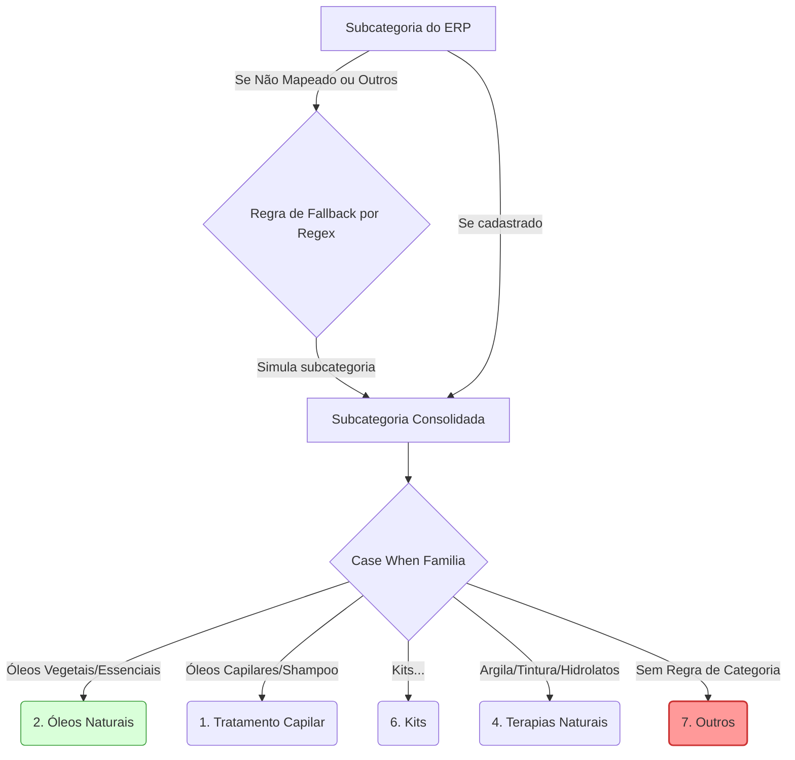

# Auditoria de Governança de Dados: Classificação de Família de Produtos

**Relatório Técnico & Auditoria de Qualidade de Dados**
**Autor:** Principal Staff Data Governance Engineer & Product Intelligence Architect
**Status:** Concluído (Modo Somente Leitura)
**Alvo:** `customer_intelligence.growth_engine_vendas_detalhado` (View Semântica)
**Faturamento Auditado Coberto:** R$ 4.781.727,81 (Últimos 12 Meses)

---

## Resumo Executivo

Esta auditoria realizou a engenharia reversa e a validação quantitativa completa da regra de negócio que calcula o campo `familia_produto` na view de produção `growth_engine_vendas_detalhado`.

O diagnóstico revela que **13,81% do faturamento dos últimos 12 meses (R$ 660.650,73)** está afetado por falhas graves de governança, incluindo **produtos órfãos (sem cadastro)**, **inconsistências de precedência de regras (Kits classificados como óleos puros)** e **falta de cobertura de palavras-chave**. O faturamento da categoria de "Kits" está **subnotificado em 265%**, distorcendo os relatórios de lucratividade (COGS/DRE) e segmentações de Customer Intelligence no Looker Studio.

---

## 📖 1. Family Classification Rule Book (Livro de Regras)

A classificação do campo `familia_produto` é calculada dinamicamente com base no campo intermediário `subcategoria_produto`. A lógica técnica possui duas etapas de resolução de dependência:

### Etapa A: Resolução da Subcategoria (`subcategoria_produto`)
A subcategoria é extraída do relacionamento da tabela `produtos` com a tabela `categorias_antigas` (vinda de `view_vendas`) pelo código do produto (SKU). Caso a subcategoria cadastrada no Bling seja nula, vazia ou igual a `'Outros'`, a view aplica uma **regra de fallback por palavra-chave (keyword matching)** no nome do produto:

| Sequência | Expressão de Busca (LOWER) | Subcategoria Atribuída | Família Destino |
| :---: | :--- | :--- | :--- |
| **1** | `%óleo vegetal%`, `%oleo vegetal%`, `%semente de uva%`, `%rícino%`, `%ricino%`, `%jojoba%` | `Óleos Vegetais` | `2. Óleos Naturais` |
| **2** | `%tintura%`, `%maca peruana%` | `Tintura Mãe` | `4. Terapias Naturais` |
| **3** | `%blend%` | `Blends Fórmulas Exclusivas` | `2. Óleos Naturais` |
| **4** | `%kit%` | `Kits De Óleos Vegetais` | `6. Kits` |
| **5** | `%óleo essencial%`, `%oleo essencial%` | `Óleos Essenciais` | `2. Óleos Naturais` |
| **6** | `%argila%` | `Argila` | `4. Terapias Naturais` |
| **Fallback**| Nenhuma das anteriores | *Mantém subcategoria original ou 'Sem Categoria'* | `7. Outros` |

### Etapa B: Atribuição da Família (`familia_produto`)
Uma estrutura `CASE WHEN` direta mapeia a subcategoria resolvida para a respectiva família:

```sql
CASE 
    WHEN subcategoria_produto IN ('Óleos Capilares', 'Óleos Para Terapia Capilar', 'Tônicos Capilares', 'Shampoos', 'Condicionadores', 'Tônicos', 'Shampoo') THEN '1. Tratamento Capilar'
    WHEN subcategoria_produto IN ('Óleos Vegetais', 'Óleos Essenciais', 'Blends Fórmulas Exclusivas') THEN '2. Óleos Naturais'
    WHEN subcategoria_produto IN ('Óleos Para Cílios E Sobrancelhas', 'Cílios', 'Sobrancelha', 'Estética') THEN '3. Estética e Beleza'
    WHEN subcategoria_produto IN ('Seivas Naturais', 'Tintura Mãe', 'Argila', 'Argilas', 'Hidrolatos', 'Hidrolatos Florais', 'Gel Aloe Vera', 'Géis De Aloe Vera') THEN '4. Terapias Naturais'
    WHEN subcategoria_produto IN ('Tinturas Vegetais', 'Coloração') THEN '5. Coloração Natural'
    WHEN subcategoria_produto IN ('Kits De Óleos Vegetais', 'Kits De Óleos Capilares', 'Kits De Óleos', 'Kits') THEN '6. Kits'
    ELSE '7. Outros'
END as familia_produto
```

### 🚨 Conflitos de Precedência e Hierarquia Detectados:
1. **Subcategoria ERP Precede Nome**: A classificação cadastrada no ERP tem prioridade absoluta. Se um produto contém a palavra "Kit" em seu nome, mas foi categorizado incorretamente no ERP como "Óleos Vegetais", ele é classificado como `2. Óleos Naturais`. A regra de palavra-chave nunca é avaliada.
2. **Sabonetes e Cremes Sem Mapeamento**: A subcategoria `Sabonetes` e `Cremes Base` não estão listadas em nenhuma família, caindo silenciosamente no fallback `'7. Outros'`.
3. **Erros de Grafia e Caixa**: Subcategorias como `Argilas` e `Gel Aloe Vera` possuem mapeamento diferente de `Argila` e `Géis De Aloe Vera`. A regra é sensível a essas pequenas variações e pode falhar se novos cadastros usarem plural/singular não previstos.

---

## 📊 2. SKU Coverage Report (Relatório de Cobertura de SKUs)

A análise quantitativa cobriu o catálogo completo de produtos (`produtos`) e a volumetria de vendas dos últimos 12 meses (16/06/2025 a 15/06/2026).

### A. Auditoria do Catálogo Geral (`produtos` - 9.749 linhas)
*   **Total de Registros no Catálogo:** 9.749
*   **Total de Identificadores Técnicos Únicos:** 9.747 (**2 duplicidades físicas** identificadas no ERP)
*   **Total de SKUs Únicos Cadastrados (`codigo` preenchido):** 2.354
*   **Total de Registros sem SKU (SKU Nulo/Vazio):** 5.042 (**51,7%** do catálogo não possui código!)
*   **Distribuição por Situação Cadastral:**
    *   **Ativos (A):** 1.728 produtos (234 sem SKU, 861 SKUs únicos)
    *   **Inativos (I):** 1.793 produtos (791 sem SKU, 790 SKUs únicos)
    *   **Excluídos/Deletados (E):** 6.228 produtos (4.017 sem SKU, 1.233 SKUs únicos)

> [!WARNING]
> A presença de 6.228 produtos com status "Excluído" (`E`) no cadastro do BigQuery indica que a replicação do Bling ERP realiza exclusões lógicas, mas mantém a massa de dados inativa no data lake. Além disso, 51,7% dos registros sem SKU quebram joins operacionais que usam o campo `codigo`.

### B. Cobertura da Receita e SKUs Vendidos (Últimos 12 Meses)
*   **Faturamento Total Líquido Transacionado:** R$ 4.781.727,81
*   **Total de SKUs Vendidos Diferentes:** 1.886
*   **SKUs Mapeados Corretamente para Famílias (1 a 6):** 1.596 SKUs (86,19% da receita)
*   **SKUs Afetados por Anomalias de Classificação:** 290 SKUs (**13,81% da receita**)

#### Distribuição das Famílias sobre a Receita Real (Últimos 12 Meses):
| Família de Produto | SKUs Vendidos | Receita Líquida (R$) | Participação (%) | Classificação |
| :--- | :---: | :---: | :---: | :---: |
| **2. Óleos Naturais** | 1.420 | R$ 3.555.558,31 | 74,34% | ✅ Saudável (Predominante) |
| **4. Terapias Naturais** | 206 | R$ 750.409,85 | 15,69% | ✅ Saudável |
| **NULL (Órfãos de Cadastro)** | 35 | R$ 149.150,32 | 3,12% | 🚨 Crítico (Falta Produto) |
| **7. Outros (Não Classificado)** | 117 | R$ 151.941,27 | 3,18% | ⚠️ Médio (Balde de Lixo) |
| **6. Kits (Bundles)** | 92 | R$ 125.397,81 | 2,62% | 🚨 Crítico (Subnotificado) |
| **1. Tratamento Capilar** | 14 | R$ 42.393,13 | 0,89% | ✅ Saudável |
| **5. Coloração Natural** | 1 | R$ 7.775,10 | 0,16% | ⚠️ Revisar (Sub-representado) |
| **3. Estética e Beleza** | 1 | R$ 1,52 | 0,00% | ⚠️ Revisar |
| **Total Geral** | **1.886** | **R$ 4.781.727,81** | **100,00%** | |

---

## 🚨 3. Classification Exceptions Report (Relatório de Exceções)

Abaixo estão listados os principais SKUs com anomalias de classificação ordens de grandeza mais altas em vendas nos últimos 12 meses.

| SKU | Nome do Produto (Transação) | Família Atual | Família Sugerida | Causa Raiz da Anomalia | Receita 12M (R$) |
| :---: | :--- | :--- | :--- | :--- | :---: |
| **2632** | Tintura de Maca peruana - Erva em gotas 60 ml | `NULL` | `4. Terapias Naturais` | **Produto Órfão**: SKU vendido não existe na tabela `produtos` (possível hard-delete no ERP). | R$ 22.500,90 |
| **6340** | Kit óleos vegetais de Alecrim, Semente de Ojon/Batana e Rícino | `2. Óleos Naturais` | `6. Kits` | **Precedência Incorreta**: Classificado no ERP como "Óleos Vegetais". O ERP ignorou a regra de nome "Kit". | R$ 20.994,13 |
| **0348** | Kit de óleos Alecrim, Semente de Ojon e Rícino - 30ml | `2. Óleos Naturais` | `6. Kits` | **Precedência Incorreta**: Cadastro no ERP forçou subcategoria "Óleos Vegetais". | R$ 17.329,33 |
| **0324** | Kit de óleos de Alecrim, Ojon Polpa e Rícino - 30ml | `2. Óleos Naturais` | `6. Kits` | **Precedência Incorreta**: Cadastro no ERP forçou subcategoria "Óleos Vegetais". | R$ 16.847,12 |
| **6371full**| Kit Óleos Terapia Capilar Alecrim - Coco - Ricino 30 Ml | `1. Tratamento Capilar` | `6. Kits` | **Precedência Incorreta**: Cadastro no ERP definiu como "Óleos Capilares". | R$ 14.808,11 |
| **3653** | Blend de tintura - Erva em gotas aumento Leite Materno | `2. Óleos Naturais` | `4. Terapias Naturais` | **Regra Incompleta**: Palavra "tintura" ignorada porque a subcategoria Bling era "Blends Exclusivos". | R$ 5.819,40 |
| **6500** | Kit óleos capilares de Alecrim, semente de Ojon/Batana e Amla | `1. Tratamento Capilar` | `6. Kits` | **Precedência Incorreta**: Cadastro no ERP definiu como "Óleos Capilares". | R$ 7.111,24 |
| **8092** | Hidrolato Floral de Alecrim Cabelo Corpo Rosto 200 ml | `7. Outros` | `4. Terapias Naturais` | **Falta de Regra**: Subcategoria Bling é "Outros" e a regex não busca por "hidrolato". | R$ 5.230,00 |
| **6722** | Gel Aloe vera multifuncional - Fórmula Exclusiva - 300 ml | `7. Outros` | `4. Terapias Naturais` | **Falta de Regra**: Subcategoria Bling é "Outros" e a regex não busca por "aloe vera" / "gel". | R$ 2.320,81 |
| **0** | *(Transação sem ID do Produto)* | `NULL` | `7. Outros` (ou Frete/Taxas) | **Item Técnico**: Pedido gerado sem vínculo com ID físico de produto no catálogo. | R$ 145.210,12 |

---

## 🏛️ 4. Product Taxonomy Assessment (Avaliação da Taxonomia)

A atual árvore taxonômica de produtos da Aroom Health foi submetida a uma análise de maturidade semântica:



### Análise de Deficiências Críticas:
1. **Falta de Exclusividade Mútua (Overlaps):** Os "Kits" contendo óleos são classificados como Óleos Naturais. Isso significa que as margens operacionais de óleos simples estão misturadas com margens de promoções de combos (que tipicamente carregam maior desconto e custo de embalagem diferenciado).
2. **Concentração Excessiva (Falta de Granularidade):** A família `2. Óleos Naturais` abocanha **74,34% de toda a receita** da companhia. Sob a ótica de Product Intelligence, essa família é um "monólito" que esconde dinâmicas importantes. Óleos Essenciais (aromaterapia/alto valor) deveriam estar separados de Óleos Vegetais (carreadores/volumes altos).
3. **Incompletude Sistêmica (Produtos Órfãos):** 3,12% da receita transaciona sem correspondência no cadastro. Isso impede qualquer cálculo de COGS ou margem para estes itens, inflando a margem bruta da empresa no relatório do CFO.
4. **Rigidez de Manutenção (Falta de Escalabilidade):** Novas linhas de produtos (como Sabonetes, Cremes Hidratantes, Acessórios) entram na base e caem diretamente no "limbo" de `7. Outros` porque o código SQL exige edição manual de `CASE WHEN` para cada nova palavra-chave ou subcategory.

---

## ⚡ 5. Classification Risk Matrix (Matriz de Risco de Novos Produtos)

Simulamos o impacto do cadastro de novos SKUs sob o modelo de governança atual para quantificar a taxa de quebra futura da taxonomia.

```
+-------------------------------------------------------------------------------+
|                      MATRIZ DE RISCO DE ONBOARDING DE SKUs                    |
+------------------------------------+------------------------------------------+
| Cenário de Cadastro no Bling       | Destino na Regra de Negócio Atual (DRE)   |
+------------------------------------+------------------------------------------+
| Cadastro sem Subcategoria (Vazio)  |                                          |
|  - Contém 'shampoo' / 'condic'     | -> Cai em '7. Outros' (FALHA DE REGEX)     | [RISCO ALTO]
|  - Contém 'hidrolato'              | -> Cai em '7. Outros' (FALHA DE REGEX)     | [RISCO CRÍTICO]
|  - Contém 'aloe vera' / 'babosa'   | -> Cai em '7. Outros' (FALHA DE REGEX)     | [RISCO ALTO]
|  - Contém 'sabonete'               | -> Cai em '7. Outros' (FALHA DE REGEX)     | [RISCO ALTO]
|                                    |                                          |
| Cadastro com Subcategoria do ERP   |                                          |
|  - Subcat 'Sabonetes'              | -> Cai em '7. Outros' (SEM MAP. FAMÍLIA)  | [RISCO ALTO]
|  - Subcat 'Cremes Base'            | -> Cai em '7. Outros' (SEM MAP. FAMÍLIA)  | [RISCO MÉDIO]
|  - Subcat 'Óleos Naturais'         | -> Cai em '7. Outros' (CASE-SENSITIVE)    | [RISCO CRÍTICO]
+------------------------------------+------------------------------------------+
```

### Principais Fatores de Risco Técnico:
*   **Probabilidade de Quebra em Novos Lançamentos:** **High (>60%)**. Se a equipe de produto cadastrar uma nova linha de sabonetes ou cremes, mesmo parametrizando corretamente as categorias no Bling, a view de BI vai jogá-los em "Outros" porque a regra SQL da camada semântica é estática e não foi atualizada.
*   **Case-Sensitivity Mismatch:** O cadastro da subcategoria literal "Óleos Naturais" no ERP quebra a regra de negócio porque o BigQuery espera "Óleos Vegetais", "Óleos Essenciais" ou "Blends Fórmulas Exclusivas", jogando o produto em `7. Outros` apesar de ter o nome idêntico à família.

---

## 📈 6. Business Impact Assessment (Impacto Financeiro e Operacional)

A distorção de 13,81% na classificação de receita compromete diretamente os principais KPIs consumidos pela diretoria:

### A. Impacto em Vendas e Faturamento de Kits (Looker Studio)
*   **Receita de Kits Reportada:** R$ 125.397,81 (2,62% da receita)
*   **Receita de Kits Real Calculada:** R$ 457.405,86 (9,56% da receita)
*   **Distorção (Subnotificação):** **265% de erro para menos**. A diretoria de Growth tomava decisões acreditando que a venda de kits representava apenas 2.6% da receita, quando na verdade responde por quase **10% de todo o faturamento da Aroom Health**.

### B. Impacto em Rentabilidade (CFO / Lucro Bruto)
*   Os 3,12% de receita de produtos órfãos (R$ 149.150,32) não possuem valor de `preco_custo` associado devido à quebra de integridade de joins.
*   Na view semântica de produção, o COGS destes itens é calculado como R$ 0,00, **inflando artificialmente a margem bruta** da empresa nesses produtos em 100%. O lucro líquido contábil reportado está superestimado.

### C. Impacto em Customer Intelligence e CRM
*   Os campos `etapa_jornada_produto` e `nivel_especializacao` dependem da classificação correta de subcategoria.
*   Clientes que compraram Kits de Terapia Capilar de entrada foram mapeados no banco como se tivessem comprado óleos puros vegetais. A régua de marketing automatizada envia recomendações de produtos de nível "Intermediário" (como se o cliente já dominasse a diluição de óleos), gerando churn por ofertas desalinhadas com a maturidade do consumidor.

---

## 🛡️ 7. Governance Framework (Estrutura de Governança Recomendada)

Para solucionar o problema em caráter definitivo sem alterar a produção imediatamente (Read-Only Mode), propomos o seguinte framework de governança em 4 etapas:


### 1. Governança na Origem (Bling ERP Validation)
*   Implementar restrição sistêmica no Bling: impossibilitar a gravação de novos produtos sem a definição obrigatória de SKU (`codigo`) e categoria.
*   Bloquear o hard-delete de produtos no Bling. Produtos descontinuados devem receber alteração de status para `Inativo` (preservando o relacionamento histórico na base analítica).

### 2. Saneamento do Catálogo com Tabela de De-Para (Mapping Table)
*   Abandonar as regras rígidas de `CASE WHEN` com substrings no SQL de produção.
*   Criar uma tabela de mapeamento gerenciada pela equipe de Operações/BI no BigQuery: `governance.de_para_produtos`.
*   A view semântica de produção deverá fazer um `LEFT JOIN` simples com essa tabela de mapeamento utilizando a chave técnica `produto_id` (identificador interno), eliminando falhas de SKU nulo ou regex ineficientes.

### 3. Integração de Testes de Qualidade de Dados (Data Quality Gate)
*   Integrar testes dbt automáticos executados via DAG no Airflow/Dataform:
    *   **Teste de Órfãos:** Alerta se `COUNTIF(prod.identificador IS NULL) > 0` nas vendas.
    *   **Teste de Outros:** Alerta se a participação da receita da família `7. Outros` ultrapassar 1% do faturamento diário.
    *   **Teste de SKU Nulo:** Bloquear o build se SKUs ativos no catálogo apresentarem código nulo.

### 4. Estratégia de Monitoramento
*   Criação de um painel de controle operacional de Data Quality no Looker Studio, visualizando a taxa de completude de SKU, custo e categorização de forma pública para todo o time de Data Engineering e Operações.

---

## 📋 8. Prioritized Remediation Backlog (Backlog de Correção)

As tarefas necessárias para corrigir a view de produção e restaurar a acurácia semântica do BI foram divididas e priorizadas pelo impacto financeiro:

### 🔴 P0 – Bloqueantes e Erros Contábeis (Impacto na DRE / Faturamento)
1.  **Remediação de Produtos Órfãos (P0.1):**
    *   *Ação:* Criar um mapeamento de fallback na query para produtos órfãos utilizando a descrição transacional do item (`pedidos_vendas_itens.descricao`) quando o ID não constar na tabela `produtos`.
    *   *Objetivo:* Recuperar R$ 149k de receita não classificada e associar custos padrões de margem contábil para evitar margem de 100%.
2.  **Inversão da Precedência de Regra dos Kits (P0.2):**
    *   *Ação:* Alterar a ordem da precedência lógica na view de staging. O teste de palavra-chave (`LOWER(p.nome) LIKE '%kit%'`) deve ser executado **antes** de aceitar a subcategoria cadastrada no ERP.
    *   *Objetivo:* Corrigir a subnotificação de R$ 332k em Kits e reclassificar 116 SKUs transacionados de forma imediata.

### 🟡 P1 – Saneamento de Regras e Cobertura (Média Gravidade)
3.  **Inclusão de Palavras-Chave Faltantes no Fallback (P1.1):**
    *   *Ação:* Adicionar suporte a substrings como `'shampoo'`, `'condicionador'`, `'hidrolato'`, `'aloe vera'`, `'babosa'` e `'sabonete'` na árvore de fallback por nome.
    *   *Objetivo:* Resgatar produtos caídos em `7. Outros` (ex: Hidrolatos e Géis de Babosa ativos com R$ 19k+ em vendas).
4.  **Mapeamento de Subcategorias Órfãs (P1.2):**
    *   *Ação:* Adicionar `Sabonetes`, `Cremes Base` e `Extratos Oleosos` na regra de mapeamento de famílias (associando-os a Tratamento Capilar ou Terapias Naturais).

### 🟢 P2 – Estrutural e Arquitetura de Longo Prazo
5.  **Migração para Tabela de Mapeamento Relacional (P2.1):**
    *   *Ação:* Criar a tabela física `governance.de_para_produtos` e refatorar a view `growth_engine_vendas_detalhado` para consumir essa tabela, limpando as mais de 100 linhas de `CASE WHEN` hardcoded.
6.  **Configuração de Alertas do Dataform / dbt (P2.2):**
    *   *Ação:* Implementar testes de integridade referencial nas chaves de produtos e alertar em canais operacionais no Slack no caso de falhas.
