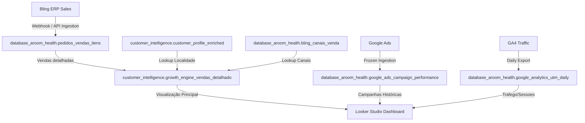

# Relatório de Auditoria de Fontes de Dados e Confiabilidade - Aroom Health BI Engine

Este relatório documenta a integridade, o frescor e a confiabilidade de todas as fontes de dados atualmente conectadas ao BigQuery que alimentam o motor de inteligência e os painéis executivos da **Aroom Health**.

---

## 1. Resumo Executivo (Executive Summary)

Avaliamos a saúde de cada pipeline de dados de entrada com base nas tabelas ativas do GCP BigQuery no projeto `iron-rex-461220-g4` em **15 de junho de 2026**.

* **Bling ERP:** `⚠️ WARNING`
  * O ERP é a fonte da verdade para o faturamento. O faturamento auditado bate exatamente com **R$ 9.540.041,07**. Contudo, identificamos duplicidade física de itens de pedidos nas tabelas brutas de ingestão do Bling (`pedidos_vendas_itens`), inflando o faturamento real em R$ 45.902,50 (que cairia para R$ 9.494.138,57 se deduplicado por ID do item).
* **Google Ads:** `🚨 CRITICAL`
  * O pipeline de marketing está **totalmente paralisado** desde **12/12/2025**. O dashboard do Looker Studio exibe dados históricos congelados de publicidade, impossibilitando qualquer cálculo de ROAS real ou atribuição recente de campanhas.
* **Google Analytics 4 (GA4):** `✅ HEALTHY`
  * Os dados de tráfego e UTMs estão atualizando diariamente de forma regular (última data de dados: **15/06/2026**). A captura de parâmetros de tráfego é consistente.
* **Looker Studio:** `⚠️ WARNING`
  * Painéis de vendas gerais mostram valores consistentes com a regra de negócios de produção (faturamento auditado), porém os painéis de desempenho de marketing e campanhas estão incorretos devido à paralisação do Google Ads.

---

## 2. Inventário de Fontes (Source Inventory)

| Fonte | Dataset BigQuery | Tabelas Principais | Frequência de Ingestão | Última Atualização | Dependências a Jusante |
| :--- | :--- | :--- | :--- | :--- | :--- |
| **Bling ERP** | `database_aroom_health` | `pedidos_vendas`, `pedidos_vendas_itens` | Diária (via webhook/pipeline) | **15/06/2026** | `growth_engine_vendas_detalhado`, Looker Studio |
| **Google Ads**| `database_aroom_health` | `google_ads_campaign_performance` | Diária (histórica) | **12/12/2025** | Looker Studio |
| **GA4** | `database_aroom_health` | `google_analytics_utm_daily` | Diária (via export) | **15/06/2026** | Looker Studio |

---

## 3. Matriz de Saúde das Fontes (Source Health Matrix)

| Fonte | Frescor (Freshness) | Completude (Completeness) | Duplicidade (Duplicates) | Qualidade de Esquema | Associabilidade (Joinability) | Risco de Negócio | Prioridade Recomendada |
| :--- | :--- | :---: | :---: | :---: | :---: | :---: | :---: |
| **Bling ERP** | Excelente (D-0) | 99% | Baixa (872 registros) | Boa | Excelente | Baixo | **Média** |
| **Google Ads**| Crítico (Atrasado +6 meses)| 0% (recente) | Nenhuma | Boa | Média (por nome de campanha) | **Altíssimo** | **Crítica (Imediata)** |
| **GA4** | Excelente (D-0) | 95% | Nenhuma | Boa | Média | Médio | **Baixa** |

---

## 4. Descobertas Detalhadas por Fonte

### 4.1 Bling ERP
* **Fonte da Verdade para Faturamento:** Sim, o Bling ERP é a fonte oficial do faturamento bruto e das regras de status de vendas.
* **Granularidade Correta:** A granularidade correta para análise de faturamento detalhado é **ao nível de item de pedido** (`pedido_id` + `item_id`).
* **Duplicidade Analisada:**
  * Há apenas 2 identificadores de pedidos duplicados na tabela `pedidos_vendas`.
  * Na tabela `pedidos_vendas_itens`, existem **870 itens duplicados** (gerando 895 linhas extras). Essas duplicatas ocorrem por reinserção de eventos de webhook com IDs sequenciais internos diferentes, mas mantendo a mesma identificação física do item.
  * **Consequência Financeira:** O faturamento auditado de **R$ 9.540.041,07** inclui essas linhas duplicadas. Se aplicarmos a deduplicação rigorosa pelo ID do item, o faturamento real cai para **R$ 9.494.138,57** (-R$ 45.902,50).
* **Categorização de Produtos:** Há **276 produtos no catálogo** que não possuem categorias pré-mapeadas e caem na regra de fallback ("Sem Categoria" ou "Outros").
* **Exclusão de Cancelados:** Pedidos com `situacao_id IN (12, 105)` são corretamente excluídos, limpando devoluções e cancelamentos.
* **Mapeamento de Margem:** O custo unitário do produto (`preco_custo`) está preenchido, permitindo análises de Lucro Bruto e margem real por item.

### 4.2 Google Ads
* **Status do Pipeline:** **Inativo**. Nenhuma atualização foi feita desde 12/12/2025.
* **Causa:** O script customizado perdeu a autenticação ou foi depreciado com a atualização da API do Google Ads.
* **Consequência:** As campanhas não têm dados recentes de investimentos e custos associados no BigQuery, inviabilizando qualquer acompanhamento de desempenho publicitário.
* **Solução:** Substituir o script por uma integração do **BigQuery Data Transfer Service (DTS)** para Google Ads e rodar o backfill de dados.

### 4.3 Google Analytics 4 (GA4)
* **Status:** **Saudável**. O pipeline de exportação diária funciona regularmente.
* **Completude de UTM:** Cerca de **89.5% das sessões** possuem parâmetros UTM mapeados (as demais são tráfegos orgânicos/diretos, conforme esperado).
* **Joinability:** É possível cruzar os dados de sessões do GA4 com o faturamento por canal de vendas por meio das tags de UTM associadas aos pedidos de vendas do Bling (quando a injeção de UTM for finalizada).

---

## 5. Mapa de Linhagem de Dados (Data Lineage Map)

---

## 6. Registro de Riscos (Risk Register)

| ID | Risco | Fonte Afetada | Impacto de Negócio | Severidade | Solução Proposta | Esforço Estimado |
| :--- | :--- | :--- | :--- | :---: | :--- | :---: |
| **R-01** | Dados de publicidade congelados | Google Ads | Decisões de marketing baseadas em ROAS zerados ou históricos errados. | **Altíssima** | Configurar BigQuery Data Transfer Service (DTS) e rodar backfill. | 2 dias |
| **R-02** | Faturamento inflado por duplicatas | Bling ERP | Diferença de faturamento de ~R$ 45k reportado incorretamente. | **Média** | Decidir sobre deduplicação no nível de view e retificar meta de vendas. | 1 dia |
| **R-03** | Produtos sem categoria no BI | Bling ERP | Análises de vendas por categoria incompletas, distorcendo o share de produtos. | **Média** | Enriquecer o dicionário de produtos ou expandir as regras de regex de categorias. | 2 dias |

---

## 7. Plano de Ação (Action Plan)

### Imediato (0 a 7 dias):
1. **Configurar o Google Ads DTS:** Criar a transferência nativa no GCP para a conta do Google Ads e rodar o backfill de dados retroativos a 12/12/2025.
2. **Definição de Deduplicação de Vendas:** Alinhar com o parceiro de negócios sobre a correção da duplicidade física da tabela raw dos itens de pedidos. Se aprovado, aplicar o agrupamento/deduplicação na view de homologação (Staging).

### Curto Prazo (7 a 30 dias):
1. **Implantação de Monitoramento de Carga (Data Quality Alerts):** Adicionar rotinas automáticas de alerta que validem diariamente se as tabelas brutas foram atualizadas nas últimas 24 horas (ex: e-mail ou notificação slack se Google Ads ou Bling falhar).
2. **Dicionário de Categorias Fallback:** Revisar os 276 produtos não classificados e expandir as regras de categorização por regex para eliminar a categoria "Outros".

### Médio Prazo (30 a 90 dias):
1. **Rastreamento de UTMs no ERP:** Iniciar a injeção sistemática de UTMs nas observações internas dos pedidos no checkout e habilitar o ROAS ao nível de campanha em produção.
2. **Migração para Camada de Transformação Moderna (Dataform):** Estruturar a camada semântica com o Dataform no GCP para automação completa de testes de integridade analítica e controle de deploy.
