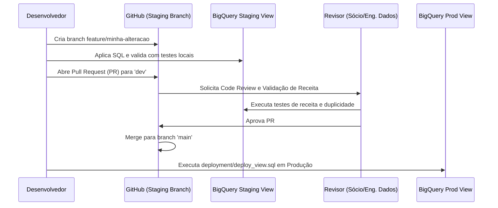

# Processo de Aprovação & Fluxo Git

Para manter a governança da camada de BI e evitar alterações acidentais na produção, estabelecemos a seguinte política de ramificações (branching policy) e revisão de código.

---

## 🌿 Estrutura de Branches

1. **`main` (Produção):**
   * Contém o código SQL idêntico ao que está rodando em produção no BigQuery.
   * **Bloqueio:** Commit direto é proibido. Toda alteração deve vir de um Pull Request homologado.
2. **`dev` (Desenvolvimento/Staging):**
   * Contém recursos em fase de teste e homologação.
   * **Bloqueio:** Commit direto desencorajado; use Pull Requests de features.
3. **`feature/*` (Novas Regras/Melhorias):**
   * Branches de trabalho criadas para desenvolver novas dimensões, correções ou refatorações (ex: `feature/ajuste-categoria-oleos`).

---

## 🔄 Fluxo de Desenvolvimento e Implantação

---

## 🔍 Checklist de Revisão de Código (Pull Request)

O revisor deve validar os seguintes pontos no PR antes de aprovar o merge para `main`:
1. **Regras SmartMetrics preservadas:** A query alterada contém as 6 dimensões SmartMetrics descritas na documentação de regras de negócio?
2. **Faturamento correto:** Os scripts de teste em staging comprovaram que o faturamento de R$ 9.540.041,07 foi mantido intacto (a menos que a alteração seja explicitamente para corrigir vendas retroativas homologadas)?
3. **Prevenção de Fan-out:** O código introduziu algum JOIN de tabela 1-para-N sem agrupamento que possa duplicar linhas no Looker Studio?
4. **Semântica de Campo:** Algum campo existente no Looker Studio foi excluído ou renomeado?
